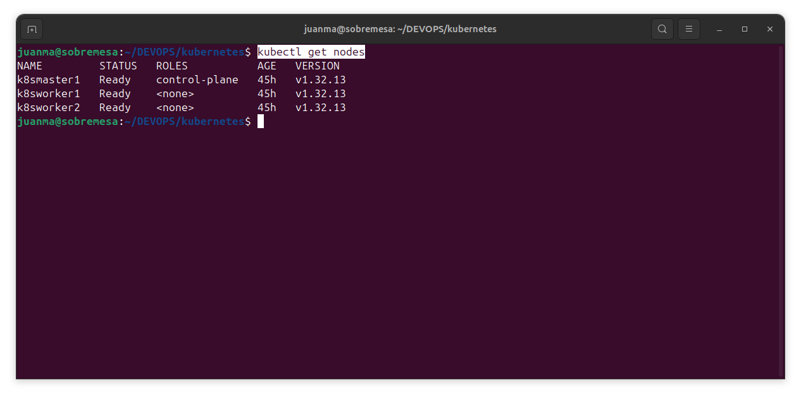
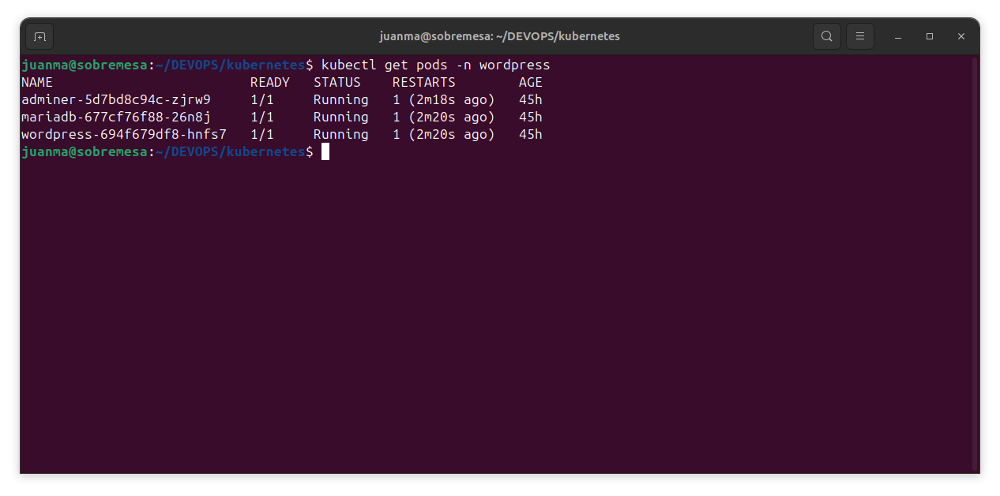
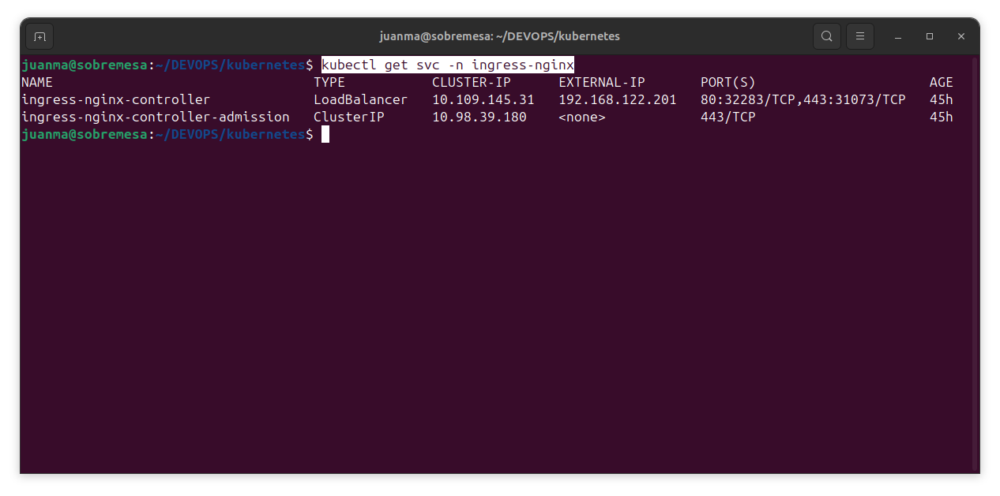
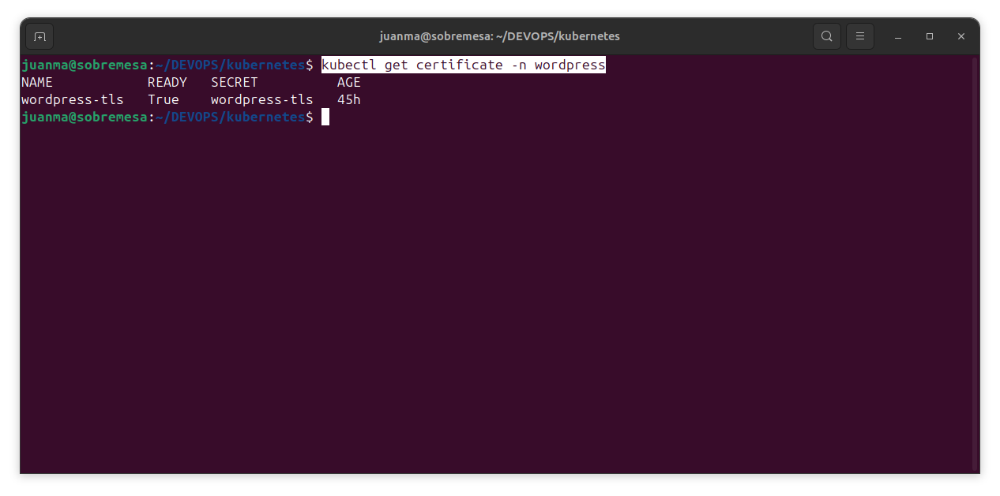
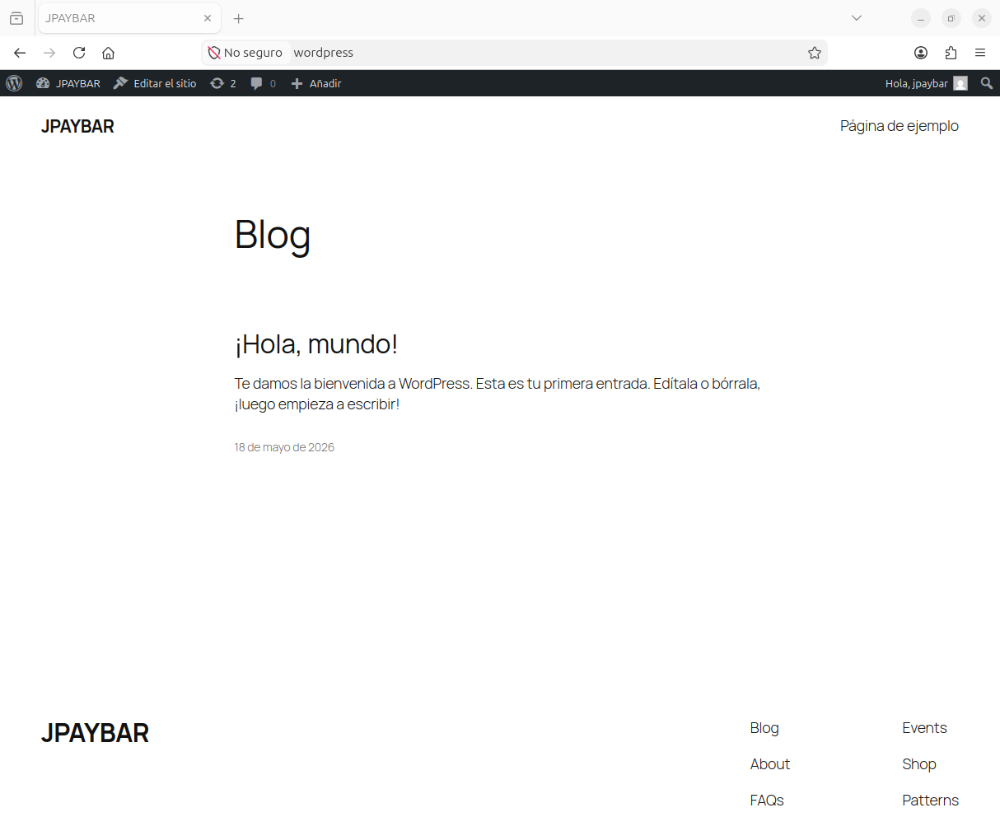
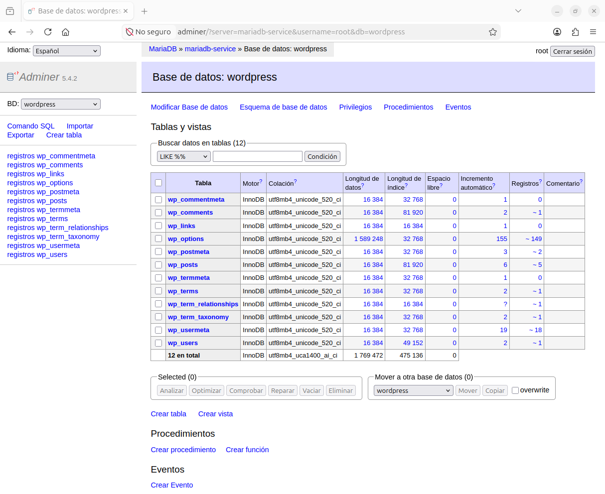

# 🔧 Kubernetes Cluster on Ubuntu 24.04 — KVM + Ansible + Manifests

Despliegue automatizado de un clúster Kubernetes de 3 nodos sobre VMs KVM/libvirt con kubeadm y Ansible, incluyendo la migración completa de un stack Docker Compose a manifests nativos de Kubernetes.

**Por Juan Manuel Payán Barea / jpaybar**
[st4rt.fr0m.scr4tch@gmail.com](mailto:st4rt.fr0m.scr4tch@gmail.com)

---

## 📋 Requisitos previos

| Requisito                           | Descripción                                                          |
| ----------------------------------- | -------------------------------------------------------------------- |
| KVM/libvirt                         | Hipervisor instalado y configurado                                   |
| Ansible 2.14+                       | En la máquina de control                                             |
| kubectl                             | Cliente Kubernetes en el host                                        |
| Ubuntu 24.04 cloud image            | `noble-server-cloudimg-amd64.img` en `/var/lib/libvirt/user-images/` |
| `virsh`, `virt-install`, `qemu-img` | Herramientas de gestión de VMs                                       |

---

## 🚀 Cómo empezar

### Paso 1 — Desplegar las VMs y preparar el entorno

El script `deploy-k8s-lab.sh` realiza automáticamente:

- Crea 3 VMs KVM (k8smaster1, k8sworker1, k8sworker2) con discos COW sobre la imagen base
- Inyecta hostname, `/etc/hosts` y clave SSH vía cloud-init
- Reserva IPs estáticas en dnsmasq de libvirt por MAC
- Consulta la versión de Kubernetes disponible en el repositorio oficial
- Genera `vars/variables.yml` desde la plantilla `variables.yml.j2` con `envsubst`
- Genera el inventario `inventory_hosts.yml` de Ansible

```bash
chmod +x deploy-k8s-lab.sh
./deploy-k8s-lab.sh
```

### Paso 2 — Lanzar el playbook

```bash
ansible-playbook -i inventory_hosts.yml install_kubernetes.yml
```

### Paso 3 — Copiar el kubeconfig al host

El playbook copia automáticamente el kubeconfig al host si `copy_kubeconfig_to_host: true` está definido en `vars/variables.yml`. Si prefieres hacerlo manualmente:

```bash
scp ubuntu@<IP_MASTER>:/home/kubernetesop/.kube/config ~/.kube/config
```

### Paso 4 — Desplegar el stack de WordPress

```bash
kubectl apply -f ../manifests/wordpress/
```

### Paso 5 — Añadir entradas en /etc/hosts

```
192.168.122.201  wordpress adminer
```

### Paso 6 — Acceder a la aplicación

```
https://wordpress   → WordPress
https://adminer     → Adminer (gestor de base de datos)
```

---

## 🖥️ Infraestructura del clúster

| VM         | Rol           | IP              | RAM     | vCPUs | Disco |
| ---------- | ------------- | --------------- | ------- | ----- | ----- |
| k8smaster1 | control-plane | 192.168.122.110 | 4096 MB | 2     | 30 GB |
| k8sworker1 | worker        | 192.168.122.111 | 4096 MB | 2     | 20 GB |
| k8sworker2 | worker        | 192.168.122.112 | 4096 MB | 2     | 20 GB |

---

## ⚙️ Stack tecnológico del clúster

| Componente         | Tecnología                             |
| ------------------ | -------------------------------------- |
| SO                 | Ubuntu 24.04 LTS                       |
| Container runtime  | containerd                             |
| Kubernetes         | 1.32.x (kubeadm)                       |
| CNI                | Calico v3.29.1                         |
| StorageClass       | local-path-provisioner (Rancher)       |
| Ingress Controller | ingress-nginx                          |
| TLS                | cert-manager (autofirmado)             |
| LoadBalancer       | MetalLB (L2, pool 192.168.122.201-210) |

---

## 📦 Stack WordPress — Manifests

| Servicio      | Imagen                     | Tipo Service | Puerto |
| ------------- | -------------------------- | ------------ | ------ |
| MariaDB       | mariadb:latest             | ClusterIP    | 3306   |
| WordPress     | wordpress:latest           | ClusterIP    | 80     |
| Adminer       | adminer:latest             | ClusterIP    | 8080   |
| ingress-nginx | nginx (ingress-controller) | LoadBalancer | 80/443 |

---

## 📁 Estructura del proyecto

```
Kubernetes_playbook_on_Ubuntu_24.04/
├── deploy-k8s-lab.sh            # Script de despliegue de VMs KVM + preparación del entorno
├── install_kubernetes.yml       # Playbook Ansible (5 plays)
├── inventory_hosts.yml          # Inventario generado automáticamente por deploy-k8s-lab.sh
├── vars/
│   ├── variables.yml            # Variables generadas (no editar manualmente)
│   └── variables.yml.j2         # Plantilla fuente de variables
├── files/
│   ├── kubernetes.conf.j2       # Parámetros sysctl para networking de K8s
│   └── http-proxy.conf.j2       # Configuración de proxy (opcional)
├── public_key/
│   └── kubernetesop.pub         # Clave pública copiada por deploy-k8s-lab.sh
└── pics/                        # Capturas de pantalla del lab
```

```
manifests/wordpress/
├── 00-namespace.yml             # Namespace "wordpress"
├── 01-secrets.yml               # Credenciales MariaDB en base64
├── 02-pvc.yml                   # PersistentVolumeClaims
├── 03-mariadb.yml               # Deployment + Service MariaDB
├── 04-wordpress.yml             # Deployment + Service WordPress
├── 05-adminer.yml               # Deployment + Service Adminer
├── 06-clusterissuer.yml         # ClusterIssuer autofirmado (cert-manager)
└── 07-ingress.yml               # Ingress con TLS
```

---

## 🔑 Variables principales (`vars/variables.yml.j2`)

| Variable                   | Descripción                                                   |
| -------------------------- | ------------------------------------------------------------- |
| `kubernetes_minor_version` | Versión minor usada en la URL del repositorio (ej. `1.32`)    |
| `kubernetes_version`       | Versión completa del paquete (ej. `1.32.4-1.1`)               |
| `pod_network_ip`           | CIDR de pods para Calico (`10.10.0.0/16`)                     |
| `controller_node_ip`       | IP del nodo master                                            |
| `kubernetes_operator`      | Usuario OS creado para gestión del clúster (`kubernetesop`)   |
| `metallb_ip_range`         | Rango de IPs para MetalLB (`192.168.122.201-192.168.122.210`) |
| `proxy_enabled`            | Activar/desactivar configuración de proxy (`false`)           |

---

## 🧩 Estructura del Playbook Ansible

```
PLAY 1 — Todos los nodos
  → Paquetes base, containerd, kubeadm/kubelet/kubectl

PLAY 2 — Master (controller)
  → kubeadm init, Calico CNI, kubeconfig del operador

PLAY 3 — Workers (nodes)
  → Join al clúster con el token generado en PLAY 2

PLAY 4 — Master (post-join)
  → local-path-provisioner, ingress-nginx, cert-manager
  (se instalan después del join para evitar pods en Pending por el taint del control-plane)

PLAY 5 — Master (LoadBalancer)
  → MetalLB, IPAddressPool, L2Advertisement
  → Patch ingress-nginx-controller a tipo LoadBalancer
```

---

## 🔍 Verificación del despliegue

```bash
# Nodos del clúster
kubectl get nodes

# Pods del sistema
kubectl get pods -n kube-system

# Componentes instalados
kubectl get pods -n ingress-nginx
kubectl get pods -n cert-manager
kubectl get pods -n metallb-system
kubectl get storageclass

# Stack WordPress
kubectl get pods -n wordpress
kubectl get svc -n ingress-nginx
kubectl get certificate -n wordpress
```

### Capturas del lab

**Nodos del clúster**


**Pods WordPress**


**Ingress con IP de MetalLB**


**Certificado TLS**


**WordPress funcionando**


**Adminer funcionando**


---

## 🌐 Proxy (opcional)

Si trabajas detrás de un proxy corporativo, actívalo en `vars/variables.yml.j2`:

```yaml
proxy_enabled: true
http_proxy: "http://your-proxy:port"
https_proxy: "http://your-proxy:port"
```

---

## 👤 Autor

**Juan Manuel Payán Barea** — Administrador de Sistemas | SysOps | DevOps

[st4rt.fr0m.scr4tch@gmail.com](mailto:st4rt.fr0m.scr4tch@gmail.com)
GitHub: [jpaybar](https://github.com/jpaybar)
LinkedIn: [juanmanuelpayan](https://es.linkedin.com/in/juanmanuelpayan)
