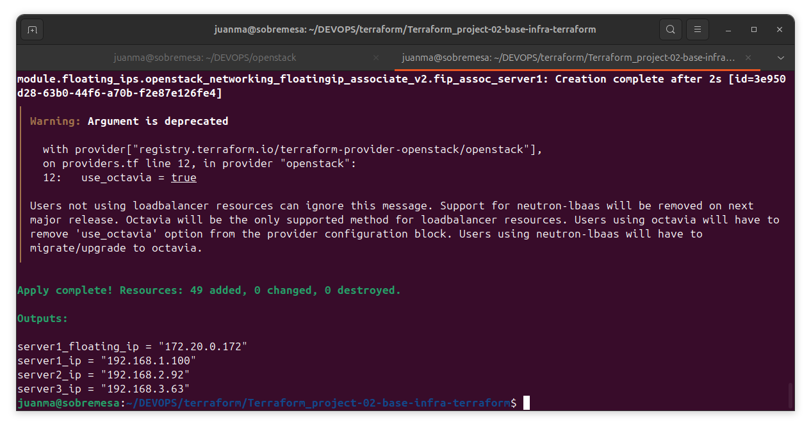
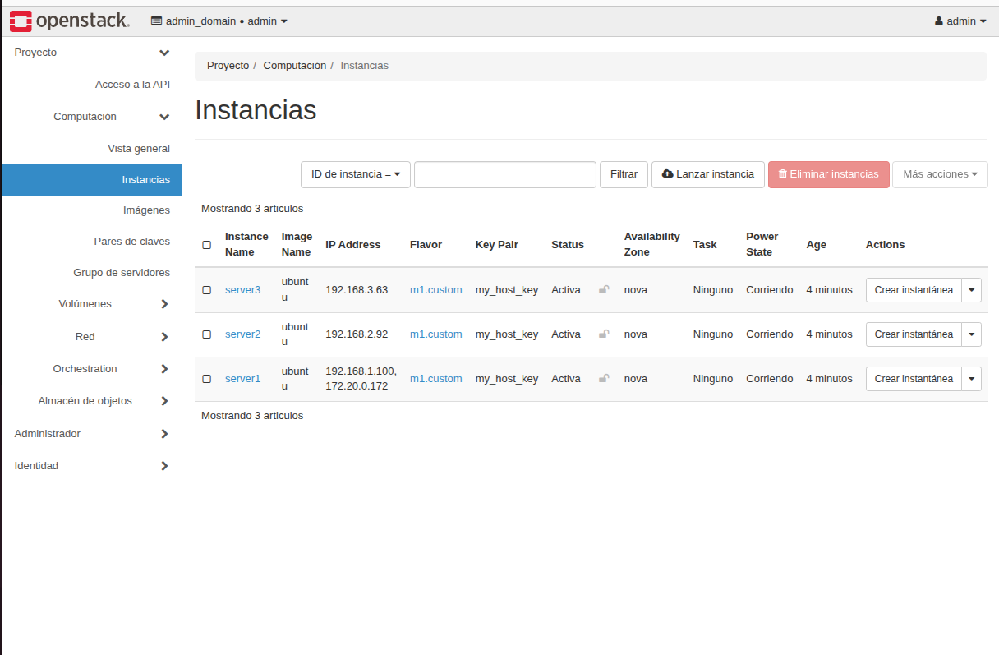
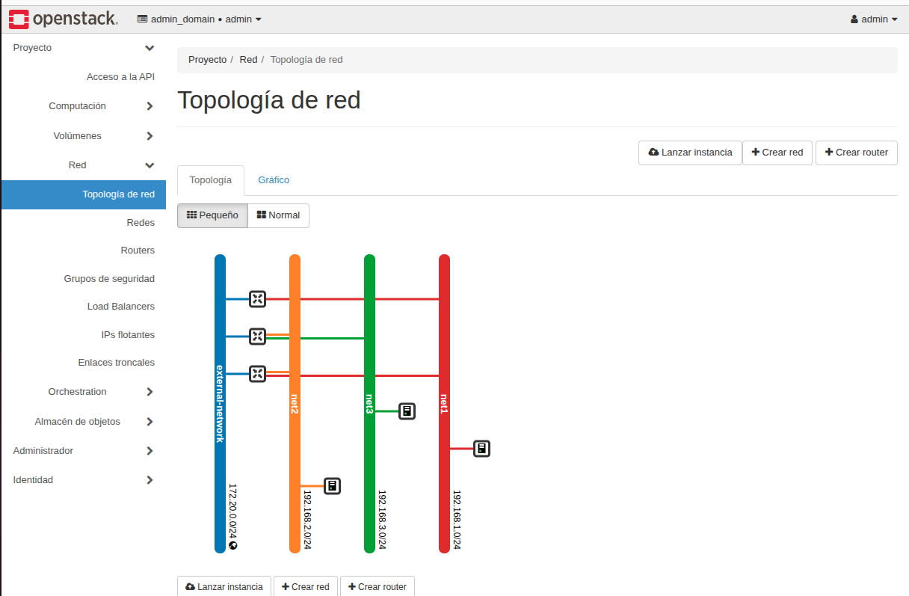
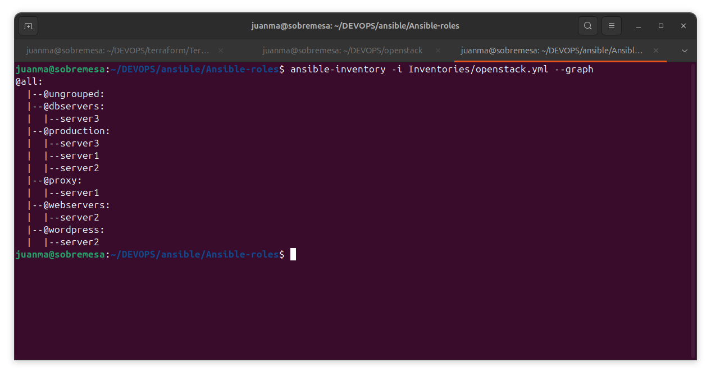
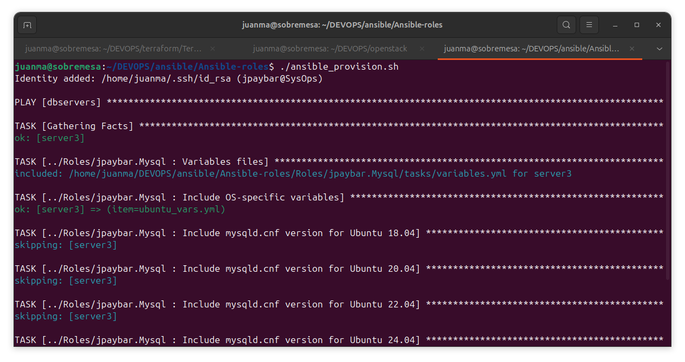
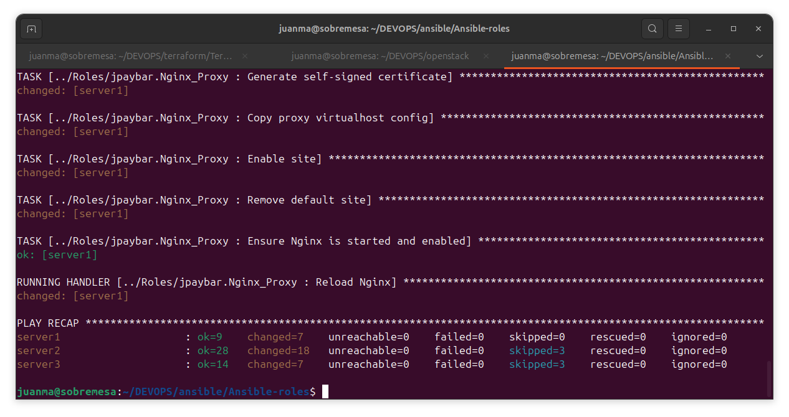
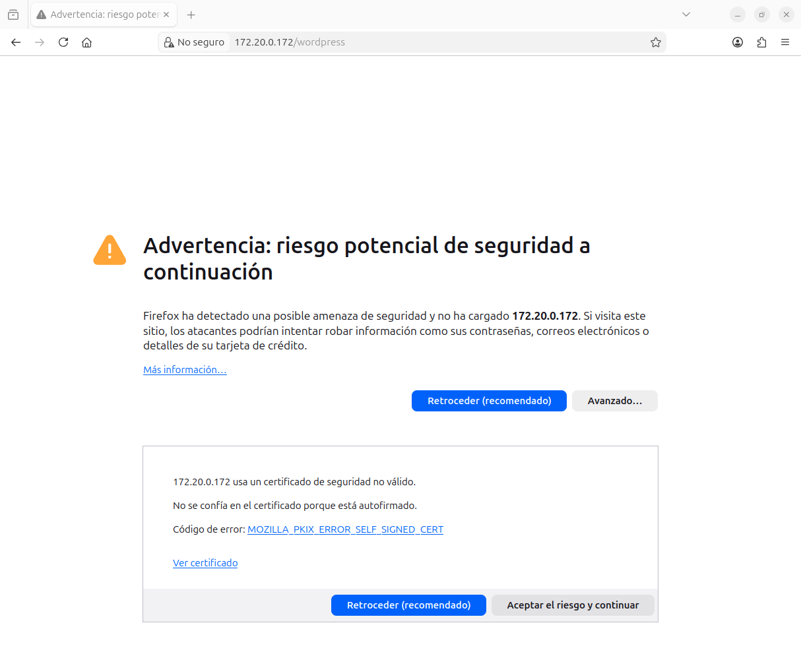
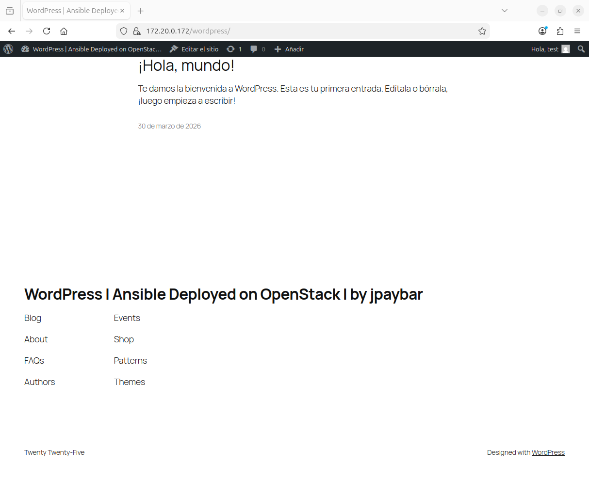

# Ansible Roles — 3-Tier WordPress Deployment on OpenStack

###### By Juan Manuel Payán Barea / jpaybar

st4rt.fr0m.scr4tch@gmail.com

---

## 📌 Overview

This project automates the full deployment of a WordPress stack on a three-tier architecture running on OpenStack, using modular and reusable Ansible roles.

The underlying infrastructure (instances, networks, routers, floating IPs and security groups) is managed by a separate Terraform project. Once the infrastructure is up, this project handles the complete software provisioning: reverse proxy, web server, PHP runtime, WordPress and database.

The project covers several real-world challenges that are rarely addressed in tutorials: dynamic OpenStack inventory without group name prefixes, SSH access chaining through ProxyJump across multiple isolated networks, and clean separation between role logic and environment-specific data via `group_vars`.

---

## 🧪 Environment

### ☁️ Infrastructure

| Component       | Details                                       |
| --------------- | --------------------------------------------- |
| Platform        | OpenStack                                     |
| Instances       | Ubuntu Server 24.04                           |
| Flavor          | `m1.custom` — 1 vCPU, 1024 MB RAM, 10 GB disk |
| Networks        | 3 isolated networks: net1, net2, net3         |
| External access | Floating IP on server1 only                   |

### 🖥️ Control Node

| Component  | Details                           |
| ---------- | --------------------------------- |
| OS         | Ubuntu 24.04                      |
| Ansible    | `ansible-core` latest             |
| Collection | `openstack.cloud`                 |
| Auth       | `~/.config/openstack/clouds.yaml` |

---

## 🌐 Architecture — Multi-Tier Network Flow

This deployment follows a strict three-tier architecture. Each tier runs on an isolated OpenStack network, and traffic flows in one direction only.

```
Internet
    │
    │  HTTPS (443) — self-signed SSL
    │  HTTP  (80)  — redirected to HTTPS
    ▼
┌──────────────────────────────────────┐
│  server1                             │  net1: 192.168.1.0/24
│  Nginx reverse proxy                 │  Floating IP (public entry point)
│  Self-signed SSL certificate         │
└────────────────┬─────────────────────┘
                 │  proxy_pass → HTTPS (443) → server2
                 ▼
┌──────────────────────────────────────┐
│  server2                             │  net2: 192.168.2.0/24
│  Apache2 + PHP-fpm + WordPress       │  Self-signed SSL certificate
│  No floating IP                      │
└────────────────┬─────────────────────┘
                 │  TCP 3306 → server3
                 ▼
┌──────────────────────────────────────┐
│  server3                             │  net3: 192.168.3.0/24
│  MySQL                               │  No floating IP
└──────────────────────────────────────┘
```

**Key network decisions:**

- server1 is the only instance with a floating IP. It terminates external SSL (Nginx) and forwards requests to server2 over HTTPS via `proxy_pass`.
- server2 runs Apache2 with its own self-signed certificate. It has no public IP — only reachable from server1 through the internal network.
- server3 accepts connections on port 3306 exclusively from net2. Fully isolated from the outside.
- OpenStack routers for net2 and net3 require `external_network_id` to enable SNAT, allowing both servers to reach the internet for package installation during provisioning — even without a floating IP.

---

## 🔗 Dependency: Terraform Project

This Ansible project **requires** the infrastructure to be deployed first using the companion Terraform project:

🔗 [Terraform_project-02-base-infra-terraform](https://github.com/jpaybar/Terraform_project-02-base-infra-terraform)

The Terraform project is responsible for:

- Creating the three instances with semantic Nova metadata (`role`, `application`, `environment`)
- Assigning fixed IPs per network and the floating IP on server1
- Creating and attaching security groups (ports 22, 80, 443, 3306)
- Configuring routers and networks with correct SNAT rules

The Nova metadata set by Terraform is the bridge between both projects: the Ansible dynamic inventory reads that metadata to build groups automatically — no manual IP configuration required.

**`terraform apply` — final output with assigned IPs:**



**OpenStack Horizon — running instances:**



**OpenStack Horizon — network topology:**



---

## 📂 Project Structure

```
Ansible-roles/
├── ansible.cfg                          # SSH and connection settings
├── ansible_provision.sh                 # Pre-flight script (run with source)
├── Inventories/
│   ├── openstack.yml                    # Dynamic OpenStack inventory plugin config
│   ├── hosts.yml                        # Static inventory (fallback / reference)
│   └── group_vars/
│       ├── proxy.yml                    # Variables for the reverse proxy tier
│       ├── webservers.yml               # SSH ProxyJump config for server2
│       ├── dbservers.yml                # SSH double-hop config for server3 + DB vars
│       └── wordpress.yml                # WordPress runtime variables
├── Playbooks/
│   ├── site.yml                         # Main playbook — full stack deployment
│   ├── apache_role_playbook.yml         # Individual role playbooks (for testing)
│   ├── mysql_role_playbook.yml
│   ├── nginx-proxy_role_playbook.yml
│   ├── php-fpm_role_playbook.yml
│   └── wordpress_role_playbook.yml
└── Roles/
    ├── jpaybar.Nginx_Proxy/             # Reverse proxy + self-signed SSL + HTTP→HTTPS redirect
    ├── jpaybar.Apache2/                 # Apache2 + self-signed SSL
    ├── jpaybar.Php-fpm/                 # PHP-fpm runtime
    ├── jpaybar.Wordpress/               # WordPress download, config and deployment
    └── jpaybar.Mysql/                   # MySQL, database and user creation
```

---

## 🎭 Ansible Roles

All roles follow the `jpaybar.RoleName` naming convention and are designed to be **portable and infrastructure-agnostic**. No role contains hardcoded IPs, hostnames or credentials — all environment-specific data comes from `group_vars/`.

Each role supports multiple Ubuntu versions (18.04, 20.04, 22.04, 24.04) through OS-specific variable files loaded at runtime via `include_tasks`.

| Role                  | Responsibility                                                                                                                                   |
| --------------------- | ------------------------------------------------------------------------------------------------------------------------------------------------ |
| `jpaybar.Nginx_Proxy` | Installs Nginx, generates a self-signed SSL certificate, deploys the VirtualHost with HTTP→HTTPS redirect and `proxy_pass` to server2 over HTTPS |
| `jpaybar.Apache2`     | Installs Apache2, generates a self-signed SSL certificate, configures the VirtualHost for WordPress                                              |
| `jpaybar.Php-fpm`     | Installs PHP-fpm and the required WordPress modules, version-matched to the Ubuntu release                                                       |
| `jpaybar.Wordpress`   | Downloads WordPress, deploys `wp-config.php` from a Jinja2 template populated with `group_vars` values                                           |
| `jpaybar.Mysql`       | Installs MySQL, creates the database and user, configures `bind-address` to accept remote connections from net2                                  |

### Main playbook — `Playbooks/site.yml`

```yaml
---
- hosts: dbservers
  become: true
  roles:
    - ../Roles/jpaybar.Mysql

- hosts: webservers
  become: true
  roles:
    - ../Roles/jpaybar.Apache2
    - ../Roles/jpaybar.Php-fpm

- hosts: wordpress
  become: true
  roles:
    - ../Roles/jpaybar.Wordpress

- hosts: proxy
  become: true
  roles:
    - ../Roles/jpaybar.Nginx_Proxy
```

The deployment order is intentional: database first, then web server and PHP, then WordPress (which needs the database already configured), and finally the proxy (which needs server2's IP already known). The groups `dbservers`, `webservers`, `wordpress` and `proxy` match exactly the groups generated by the dynamic inventory from Terraform metadata.

---

## 📋 Dynamic OpenStack Inventory

### Why dynamic inventory

In a cloud environment, IPs change with every `terraform apply`. A static inventory with hardcoded IPs becomes invalid after every redeployment. The `openstack.cloud.openstack` plugin solves this by querying the OpenStack API at runtime — the inventory is always in sync with the actual infrastructure.

### Plugin configuration — `Inventories/openstack.yml`

```yaml
plugin: openstack.cloud.openstack
cloud: openstack
expand_hostvars: true
fail_on_errors: true
legacy_groups: false

compose:
  ansible_user: "'ubuntu'"
  ansible_ssh_private_key_file: "'~/.ssh/id_rsa'"
  ansible_python_interpreter: "'/usr/bin/python3'"

groups:
  proxy:      openstack.metadata.role == 'proxy'
  webservers: openstack.metadata.role == 'webserver'
  dbservers:  openstack.metadata.role == 'database'
  wordpress:  openstack.metadata.get('application') == 'wordpress'
  production: openstack.metadata.environment == 'production'
```

### The `keyed_groups` prefix problem

`keyed_groups` is the most commonly documented option for grouping hosts by metadata in OpenStack, but it always adds a prefix to the group name that cannot be removed. For example, if the instance metadata is `role=proxy`, the generated group name is `meta-proxy` — never simply `proxy`.

This breaks the direct correspondence between inventory groups, `group_vars/` directory names, and host targets in `site.yml`, forcing workarounds throughout the project.

**Solution:** use `groups` with Jinja2 conditions instead of `keyed_groups`. With `groups`, the operator defines the exact group name — no prefix, no suffix, no post-processing needed.

### `legacy_groups: false`

Without this option, the plugin automatically generates dozens of groups based on instance names, flavors, images and tenant IDs. The result is an unreadable inventory full of irrelevant entries. Disabling legacy groups is essential in any real project.

### Verifying the inventory

```bash
# Tree view of groups and hosts
ansible-inventory -i Inventories/openstack.yml --graph

# Expected output:
# @all:
#   |--@proxy:
#   |  |--server1
#   |--@webservers:
#   |  |--server2
#   |--@dbservers:
#   |  |--server3
#   |--@wordpress:
#   |  |--server2
#   |--@production:
#   |  |--server1
#   |  |--server2
#   |  |--server3

# Full output with resolved host variables
ansible-inventory -i Inventories/openstack.yml --list
```

**Dynamic inventory resolved — clean group structure from OpenStack metadata:**



---

## 📁 `group_vars` — Separation of Responsibilities

### Design principle

An Ansible role is a **reusable component**. A role that embeds IPs or credentials is tied to a single environment and cannot be reused without modification. The strict separation between **role logic** and **environment data** is what makes a role truly portable.

The convention used in this project:

- `Roles/jpaybar.X/defaults/` — generic default values (standard ports, package names)
- `Roles/jpaybar.X/vars/` — internal role variables, not intended to be overridden
- `Inventories/group_vars/` — **everything environment-specific**: IPs, credentials, SSH connection arguments

### `group_vars/proxy.yml` — Reverse proxy tier

```yaml
---
app_server_ip: "{{ hostvars[groups['webservers'][0]]['ansible_host'] }}"
```

The IP of server2 is never hardcoded. It is resolved dynamically at runtime from the inventory using `hostvars`. If the IP changes after a `terraform destroy/apply`, no file needs to be edited — the dynamic inventory updates the value automatically.

### `group_vars/webservers.yml` — Web tier SSH access

```yaml
---
ansible_ssh_common_args: "-o StrictHostKeyChecking=no -o UserKnownHostsFile=/dev/null
  -o ProxyJump=ubuntu@{{ hostvars[groups['proxy'][0]]['ansible_host'] }}"
```

server2 has no floating IP. This variable instructs Ansible to reach server2 by jumping through server1. The floating IP of server1 is resolved dynamically from the inventory.

### `group_vars/dbservers.yml` — Database tier SSH access (double hop)

```yaml
---
ansible_ssh_common_args: >-
  -o StrictHostKeyChecking=no
  -o UserKnownHostsFile=/dev/null
  -o ForwardAgent=yes
  -o ProxyCommand="ssh -o StrictHostKeyChecking=no -o UserKnownHostsFile=/dev/null
     -o ForwardAgent=yes -W %h:%p
     -J ubuntu@{{ hostvars[groups['proxy'][0]]['ansible_host'] }}
     ubuntu@{{ hostvars[groups['webservers'][0]]['ansible_host'] }}"

mysql_db_name: "wordpress"
mysql_user_name: "test"
mysql_user_password: "test"
```

server3 sits on net3 — a network not directly reachable from server1. The connection chain is: **local machine → server1 (floating IP) → server2 (net2) → server3 (net3)**. This double hop requires a `ProxyCommand` with an embedded `-J` jump, combined with `ForwardAgent=yes` to propagate the SSH key through all hops without copying the private key to any intermediate server.

### `group_vars/wordpress.yml` — WordPress runtime variables

```yaml
---
wp_db_host: "{{ hostvars[groups['dbservers'][0]]['ansible_host'] }}"
proxy_server: "{{ hostvars[groups['proxy'][0]]['ansible_host'] }}"
```

The database host and proxy IP used in `wp-config.php` are both resolved dynamically. The `wp-config.php.j2` Jinja2 template consumes these variables directly — no manual editing between deployments.

### `hostvars` group index vs. hostname reference

Using `hostvars['server2']['ansible_host']` couples the role to a specific instance name in OpenStack. If the instance is renamed, the role breaks silently. Using `hostvars[groups['webservers'][0]]['ansible_host']` always resolves the first host in the group — resilient to instance renames and redeployments.

---

## 🔑 SSH Multi-Hop Access with ProxyJump

### The problem

server2 and server3 have no floating IP. They are only reachable from within the OpenStack internal networks. Ansible needs to reach them from the local machine, which is outside those networks.

The solution is to use server1 as an SSH bastion: the local machine connects to server1 via its floating IP, and from there jumps to server2 or server3 through the internal network IPs.

### `ansible.cfg` — Connection settings

```ini
[defaults]
host_key_checking = False
timeout = 60

[privilege_escalation]
become_timeout = 60

[ssh_connection]
# Covers SSH-level host key checking for all connections including ProxyJump intermediaries.
# host_key_checking=False only affects the final Ansible connection, not the SSH child
# processes spawned for intermediate hops.
ssh_args = -o StrictHostKeyChecking=no -o UserKnownHostsFile=/dev/null
```

### Why `~/.ssh/config` matters for ProxyJump

When Ansible establishes a ProxyJump connection, it spawns child SSH processes to handle the intermediate hops. These child processes do **not** inherit `ansible_ssh_common_args` from `ansible.cfg` or `group_vars` — they read `~/.ssh/config` directly.

If `StrictHostKeyChecking` is not disabled there, the child process fails when verifying the host key of the bastion — especially after a `terraform destroy/apply` that recreates instances with new SSH keys. The `ansible_provision.sh` script ensures the required entries are present in `~/.ssh/config` before the playbook runs.

### SSH key propagation — Agent Forwarding

OpenStack instances are created with the public key injected via cloud-init. The private key never needs to be copied to any server. Instead, `ForwardAgent=yes` propagates the local SSH agent credentials along the entire connection chain, so each hop authenticates using the same key already loaded in the local agent.

```bash
# Load the key into the local SSH agent before running the playbook
ssh-add ~/.ssh/id_rsa
```

---

## ⚙️ Pre-flight Script — `ansible_provision.sh`

The script automates the steps required before launching the playbook and ensures the SSH environment is correctly configured.

```bash
#!/bin/bash

SSH_CONFIG="$HOME/.ssh/config"

declare -A SSH_HOSTS=(
    ["172.20.0.*"]=""
    ["192.168.1.*"]=""
    ["192.168.2.*"]=""
    ["192.168.3.*"]=""
)

for host in "${!SSH_HOSTS[@]}"; do
    if ! grep -q "Host $host" "$SSH_CONFIG"; then
        echo "" >> "$SSH_CONFIG"
        echo "Host $host" >> "$SSH_CONFIG"
        echo "    StrictHostKeyChecking no" >> "$SSH_CONFIG"
        echo "    UserKnownHostsFile /dev/null" >> "$SSH_CONFIG"
        echo "SSH entry added for $host"
    fi
done

ssh-add ~/.ssh/id_rsa

ansible-playbook -i Inventories/openstack.yml Playbooks/site.yml
```

> ⚠️ **This script must be run with `source`**, not with `bash`:
> 
> ```bash
> source ansible_provision.sh
> ```
> 
> Running it as a subprocess (`bash ansible_provision.sh`) spawns a child shell. The `ssh-add` inside it loads the key into the child's SSH agent, which is destroyed when the subprocess exits. The parent shell — where Ansible actually runs — never sees the key loaded. Using `source` runs all commands in the current shell context, which is the one Ansible actually uses.

**Pre-flight script execution — SSH agent loaded, playbook launched:**



---

## 🚀 Usage

### Prerequisites

- OpenStack infrastructure deployed via the companion Terraform project
- `openstack.cloud` collection installed:

```bash
ansible-galaxy collection install openstack.cloud
```

- `clouds.yaml` with OpenStack credentials at `~/.config/openstack/clouds.yaml`
- SSH key registered in OpenStack and available locally at `~/.ssh/id_rsa`

### Full deployment

```bash
# 1. Clone the repository
git clone https://github.com/jpaybar/Ansible-roles.git
cd Ansible-roles

# 2. Verify the dynamic inventory resolves correctly
ansible-inventory -i Inventories/openstack.yml --graph

# 3. Run the pre-flight script
source ansible_provision.sh
```

### Post-deployment verification

```bash
# Ping all hosts through the ProxyJump chain
ansible -i Inventories/openstack.yml all -m ping

# Check WordPress is reachable over HTTPS
curl -k https://<FLOATING_IP>

# Verify HTTP redirects to HTTPS
curl -I http://<FLOATING_IP>
```

**Ansible Play Recap — 0 failures across all 3 hosts:**



---

### `groups` vs `keyed_groups` in the dynamic inventory

`keyed_groups` is the most documented option for grouping by metadata in OpenStack, but it always produces group names with prefixes (`meta-proxy`, `openstack_proxy`) that cannot be removed. This forces divergent naming between inventory groups, `group_vars/` directory names, and `site.yml` host targets — a maintenance problem at every layer.

Using `groups` with Jinja2 conditions gives full control over group names. The same name is used consistently across inventory, `group_vars`, and playbooks.

### Role variables vs `group_vars`

Putting IPs or credentials in a role's `vars/` or `defaults/` ties that role to a single environment. Any infrastructure change requires modifying the role itself. Keeping all environment-specific data in `group_vars/` means roles are untouched between deployments — only the inventory changes.

### `hostvars` group index vs. instance name

`hostvars['server2']['ansible_host']` breaks if the instance is ever renamed in OpenStack. `hostvars[groups['webservers'][0]]['ansible_host']` always resolves the first host in the group — resilient to instance renames and full redeployments.

### Double-hop SSH for server3

server3 sits on net3, which is not directly reachable from server1. A simple `ProxyJump` only covers one network hop. The `ProxyCommand` with an embedded `-J` flag builds the full chain: local → server1 → server2 → server3. `ForwardAgent=yes` ensures the SSH key is available at every step without copying the private key to any intermediate server.

### OpenStack routers and SNAT

net2 and net3 routers require `external_network_id` in Terraform even though server2 and server3 have no floating IP. Without it, OpenStack does not configure SNAT, and those instances have no internet egress — causing `apt install` to fail silently during Ansible provisioning. This is a common misconfiguration in multi-network OpenStack setups.

### `source` vs `bash` for the provision script

Running `bash ansible_provision.sh` spawns a subshell. The `ssh-add` inside it loads the key into the subshell's agent, which is destroyed when the subshell exits. The parent shell — where Ansible actually runs — never sees the key. `source` runs commands in the current shell, so the agent state persists correctly.

---

## 📸 Deployment Result

**Nginx reverse proxy — self-signed SSL certificate served over HTTPS:**



**WordPress installation wizard — accessible through the Nginx proxy:**



---

## 📚 References

- [Ansible — openstack.cloud.openstack inventory plugin](https://docs.ansible.com/ansible/latest/collections/openstack/cloud/openstack_inventory.html)
- [OpenStack SDK — clouds.yaml configuration](https://docs.openstack.org/openstacksdk/latest/user/config/configuration.html)
- [Jeff Geerling — Ansible for DevOps](https://www.ansiblefordevops.com/)
- [Companion Terraform project](https://github.com/jpaybar/Terraform_project-02-base-infra-terraform)

---

## 👤 Author Information

**Juan Manuel Payán Barea**
Systems Administrator | SysOps | IT Infrastructure

st4rt.fr0m.scr4tch@gmail.com

GitHub: https://github.com/jpaybar
LinkedIn: https://es.linkedin.com/in/juanmanuelpayan
