# RHAAP: From Installation to Real Automation

## Red Hat Ansible Automation Platform 2.4 — Configuration and Setup

###### By Juan Manuel Payán Barea / jpaybar

[st4rt.fr0m.scr4tch@gmail.com](mailto:st4rt.fr0m.scr4tch@gmail.com)

---

## Table of Contents

1. [Overview](#1-overview)
2. [Environment](#2-environment)
3. [Prerequisites](#3-prerequisites)
4. [Project Structure](#4-project-structure)
5. [AAP Configuration Philosophy](#5-aap-configuration-philosophy)
6. [Configuration Sequence](#6-configuration-sequence)
   - [Organization](#61-organization)
   - [SSH Credential](#62-ssh-credential)
   - [Inventory](#63-inventory)
   - [Project](#64-project)
   - [Required Collections](#65-required-collections-requirementsyml)
   - [Connectivity Test](#66-connectivity-test-ad-hoc-command)
   - [Job Template](#67-job-template)
   - [Launch the Job](#68-launch-the-job-and-verify-deployment)
7. [Role-Based Access Control (RBAC)](#7-role-based-access-control-rbac)
8. [Execution Environments (EE)](#8-execution-environments-ee)
   - [Modern EE vs Legacy EE](#81-modern-ee-vs-legacy-ee)
   - [Configuring the Legacy EE](#82-configuring-the-legacy-ee-ee-29-rhel8)
   - [Incompatibility Demonstration](#83-incompatibility-demonstration)
9. [Known Issues and Solutions](#9-known-issues-and-solutions)
10. [Official Documentation](#10-official-documentation)

---

## 1. Overview

📌 This project documents the **initial configuration of Red Hat Ansible Automation Platform 2.4** after completing the automated installation ([RHAAP_2.4_deployment](https://github.com/jpaybar/ansible/blob/main/RHAAP_2.4_deployment/README.md)).

The goal is to bring the platform from a freshly installed state to a fully operational environment capable of running real automations. It demonstrates the complete cycle: organization → credentials → inventory → project → job template → execution, including RBAC with differentiated users and management of multiple Execution Environments for modern and legacy playbooks.

### What Gets Deployed?

A three-tier WordPress stack (Nginx proxy + Apache/PHP + MySQL) is used as the reference workload, executed from AAP against KVM/libvirt VMs:

| Layer    | Server    | IP              | Role                     |
| -------- | --------- | --------------- | ------------------------ |
| Proxy    | `server1` | 192.168.122.35  | Nginx reverse proxy      |
| Web      | `server2` | 192.168.122.165 | Apache + PHP + WordPress |
| Database | `server3` | 192.168.122.28  | MySQL                    |

Additionally, a single-node WordPress LAMP stack is deployed on `server-legacy` (Ubuntu 18.04) using a legacy playbook with Ansible 2.9 to demonstrate simultaneous management of multiple Ansible versions from AAP.

---

## 2. Environment

🧪 The lab has been configured and tested with the following infrastructure:

### 🖥️ Host System

* OS: Ubuntu 24.04
* CPU: AMD Ryzen 5 3600 (6 cores)
* RAM: 32 GB
* Storage: NVMe SSD

### ⚙️ AAP Platform

| Component      | Hostname                   | IP              | Role               |
| -------------- | -------------------------- | --------------- | ------------------ |
| Controller     | rhaap-controller.lab.local | 192.168.122.101 | UI, API, scheduler |
| Execution node | rhaap-execution.lab.local  | 192.168.122.102 | Job execution      |
| Database       | rhaap-database.lab.local   | 192.168.122.103 | PostgreSQL         |

### 💻 Target VMs (3-tier WordPress stack)

| VM      | OS           | IP              | Role                     |
| ------- | ------------ | --------------- | ------------------------ |
| server1 | Ubuntu 24.04 | 192.168.122.35  | Nginx reverse proxy      |
| server2 | Ubuntu 24.04 | 192.168.122.165 | Apache + PHP + WordPress |
| server3 | Ubuntu 24.04 | 192.168.122.28  | MySQL                    |

### 💻 Target VM (legacy playbook)

| VM            | OS           | IP             | Role           |
| ------------- | ------------ | -------------- | -------------- |
| server-legacy | Ubuntu 18.04 | 192.168.122.99 | WordPress LAMP |

---

## 3. Prerequisites

* RHAAP 2.4 installed and operational ([RHAAP_2.4_deployment](../RHAAP_2.4_deployment/README.md))
* Target VMs running via `setup_target_vms.sh` (Ubuntu 24.04)
* Legacy VM running via `setup_legacy_vm.sh` (Ubuntu 18.04)
* Red Hat account with active Developer subscription
* [jpaybar/ansible](https://github.com/jpaybar/ansible) repo accessible from the controller

---

## 4. Project Structure

```
RHAAP_2.4_configuration/
├── setup_target_vms.sh       # Launches the 3 Ubuntu 24.04 target VMs
├── setup_legacy_vm.sh        # Launches the Ubuntu 18.04 legacy VM
├── hosts.yml                 # Generated inventory (3-tier VMs)
├── hosts_legacy.yml          # Generated inventory (legacy VM)
├── pics/                     # Screenshots
├── README.md                 # English documentation
└── README_es.md              # Spanish documentation
```

---

## 5. AAP Configuration Philosophy

⚠️ Before starting, it's essential to understand AAP's separation of responsibilities. Unlike Ansible CLI where everything goes in the inventory or `ansible.cfg`, in AAP each concept has its place:

| Concept                      | Where it goes in AAP             |
| ---------------------------- | -------------------------------- |
| Hosts and groups             | **Inventory**                    |
| SSH user and private key     | **Machine Credential**           |
| Playbooks and roles          | **Project** (pointing to GitHub) |
| What to run and against what | **Job Template**                 |

This allows reusing each element independently. A single credential can be used across multiple templates, just like an inventory.

> ⚠️ The AAP inventory **must not contain** `ansible_user` or `ansible_ssh_private_key_file`. These are managed by AAP through Credentials.

---

## 6. Configuration Sequence

### 6.1 Organization

`Access → Organizations → Add`

The organization is the main container for all AAP resources: inventories, credentials, projects, and templates always belong to an organization.

| Field                   | Value                                     |
| ----------------------- | ----------------------------------------- |
| Name                    | `jpaybar`                                 |
| Description             | `Main organization for the RHAAP 2.4 lab` |
| Maximum number of hosts | (empty, no limit)                         |
| Galaxy Credentials      | Ansible Galaxy (default value)            |

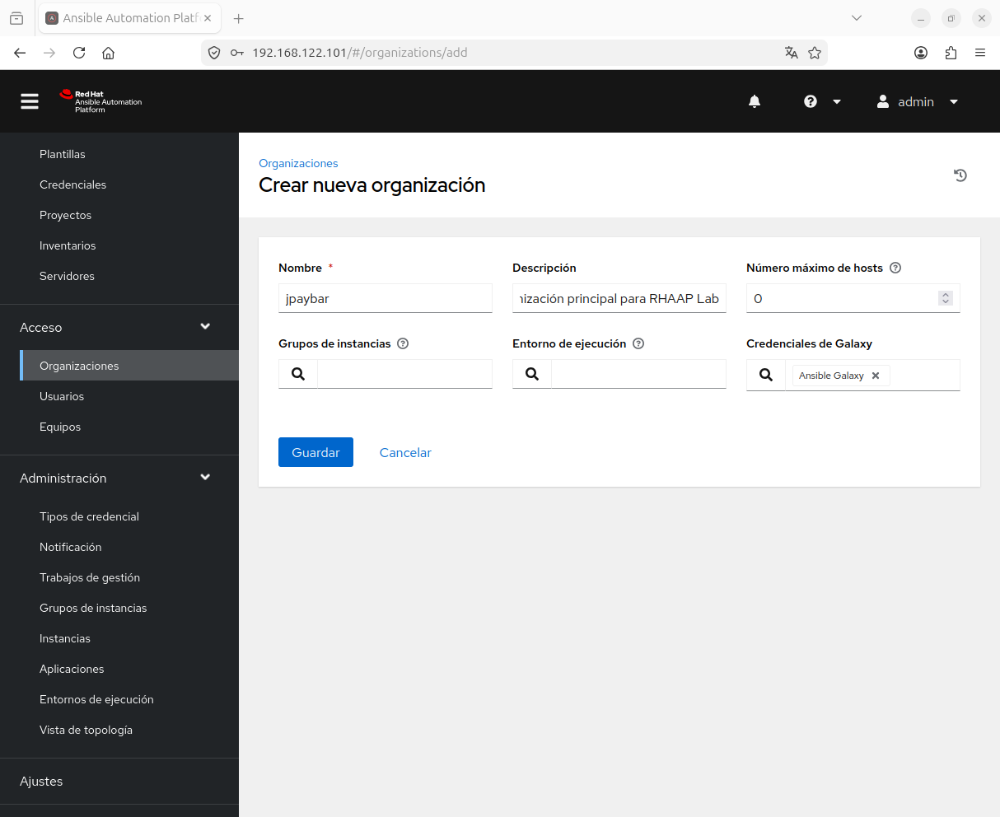

---

### 6.2 SSH Credential

`Resources → Credentials → Add`

**Machine** type credentials securely store the SSH user and private key. The key is never exposed in plain text in jobs.

| Field                       | Value                       |
| --------------------------- | --------------------------- |
| Name                        | `jpaybar_ssh_key`           |
| Credential Type             | `Machine`                   |
| Organization                | `jpaybar`                   |
| Username                    | `ubuntu`                    |
| SSH Private Key             | Contents of `~/.ssh/id_rsa` |
| Privilege Escalation Method | `sudo`                      |

```bash
cat ~/.ssh/id_rsa
```

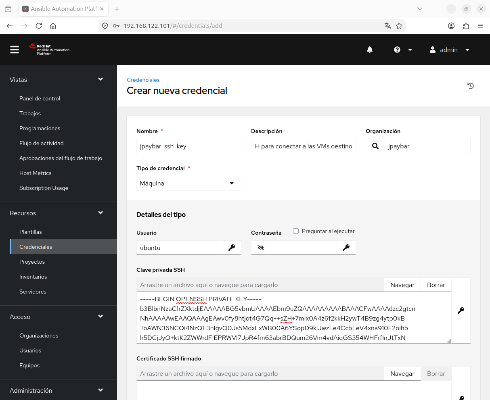

---

### 6.3 Inventory

`Resources → Inventories → Add → Add inventory`

AAP supports three inventory types:

| Type                          | Description                                                          |
| ----------------------------- | -------------------------------------------------------------------- |
| **Add inventory**             | Static. Hosts defined manually.                                      |
| **Add smart inventory**       | Combines hosts from multiple inventories with filters. Advanced use. |
| **Add constructed inventory** | Generates hosts dynamically based on variables and conditions.       |

#### Configuration

| Field            | Value                                          |
| ---------------- | ---------------------------------------------- |
| Name             | `jpaybar_inventory`                            |
| Organization     | `jpaybar`                                      |
| Variables (YAML) | `ansible_python_interpreter: /usr/bin/python3` |

#### Groups and hosts

| Group        | Host      | IP              |
| ------------ | --------- | --------------- |
| `proxy`      | `server1` | 192.168.122.35  |
| `webservers` | `server2` | 192.168.122.165 |
| `dbservers`  | `server3` | 192.168.122.28  |
| `wordpress`  | `server2` | 192.168.122.165 |

#### Variables per group

With manual inventory in AAP, the repo's `group_vars` **is not loaded automatically** — Ansible only reads it when using an inventory file. Variables must be defined in each group:

**Group `proxy`:**

```yaml
---
app_server_ip: "{{ hostvars[groups['webservers'][0]]['ansible_host'] }}"
```

**Group `webservers`:**

```yaml
---
ansible_ssh_common_args: "-o StrictHostKeyChecking=no -o UserKnownHostsFile=/dev/null"
```

**Group `dbservers`:**

```yaml
---
ansible_ssh_common_args: "-o StrictHostKeyChecking=no -o UserKnownHostsFile=/dev/null"
mysql_db_name: "wordpress"
mysql_user_name: "test"
mysql_user_password: "test"
```

**Group `wordpress`:**

```yaml
---
wp_db_host: "{{ hostvars[groups['dbservers'][0]]['ansible_host'] }}"
proxy_server: "{{ hostvars[groups['proxy'][0]]['ansible_host'] }}"
```

> 💡 **Correct future solution:** Configure an **Inventory Source** pointing to the repo's `hosts.yml`. AAP will load both the inventory and `group_vars` automatically, just like from CLI.

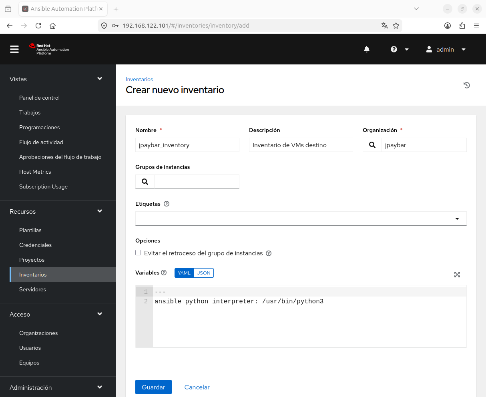

---

### 6.4 Project

`Resources → Projects → Add`

The project connects AAP to the GitHub repository where roles and playbooks are stored. AAP clones the repo to `/var/lib/awx/projects/`.

| Field               | Value                                |
| ------------------- | ------------------------------------ |
| Name                | `jpaybar_wordpress`                  |
| Organization        | `jpaybar`                            |
| Source Control Type | `Git`                                |
| URL                 | `https://github.com/jpaybar/ansible` |
| Branch              | `main`                               |
| Options             | ✅ Update revision on launch          |

Once saved, AAP automatically syncs the repo. Expected status: **✅ Successful**.

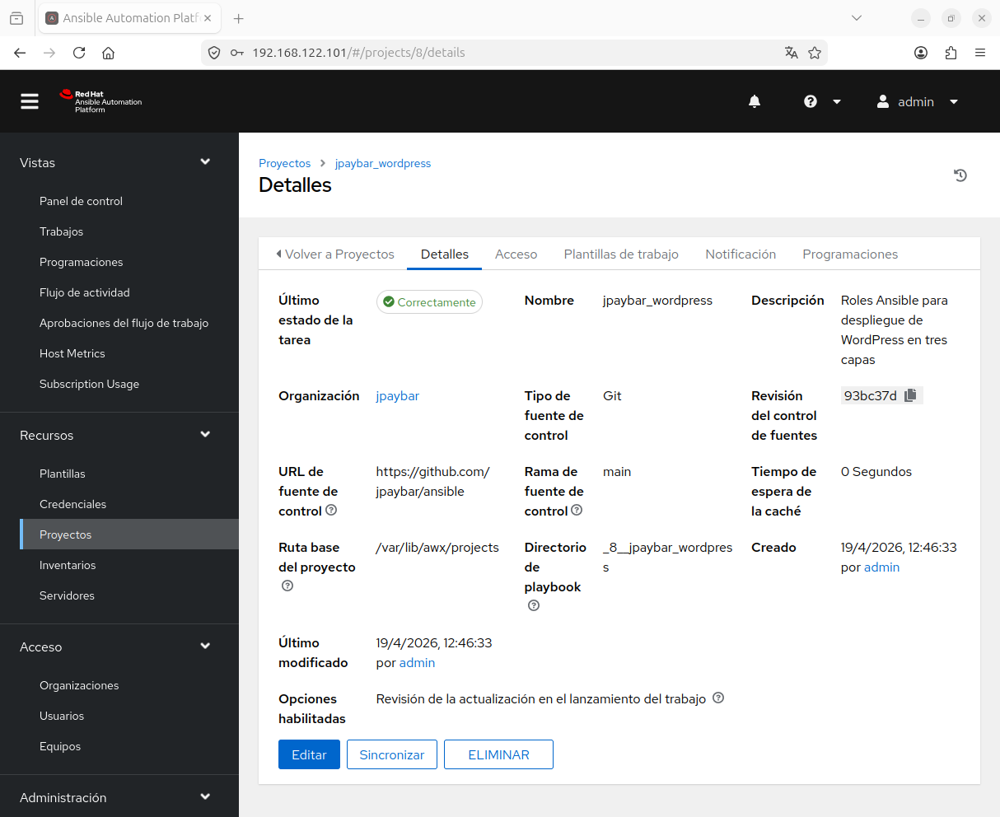

---

### 6.5 Required Collections: `requirements.yml`

AAP executes playbooks inside an Execution Environment that only includes default collections. The `mysql_user` module belongs to `community.mysql` and is not included. Without the `requirements.yml` file the job fails with:

```
ERROR! couldn't resolve module/action 'mysql_user'
```

**File:** `collections/requirements.yml` (at the repo root)

```yaml
---
collections:
  - name: community.mysql
  - name: community.general
```

> ⚠️ AAP looks for `requirements.yml` at `collections/requirements.yml` relative to the project root. If placed in a subdirectory it won't be detected.

---

### 6.6 Connectivity Test (Ad-hoc Command)

`Resources → Inventories → jpaybar_inventory → Hosts → Run command`

Before launching the real job, SSH connectivity from the execution node is verified.

> 💡 **What is an ad-hoc command?** Runs an Ansible module directly against hosts without a playbook. Equivalent to `ansible all -m ping` from CLI.

| Field                 | Value                           |
| --------------------- | ------------------------------- |
| Module                | `ping`                          |
| Execution Environment | `Default execution environment` |
| Credential            | `jpaybar_ssh_key`               |

> ⚠️ The execution node has its own empty `~/.ssh/known_hosts`. `StrictHostKeyChecking=no` in group variables is essential to avoid fingerprint confirmation timeouts.

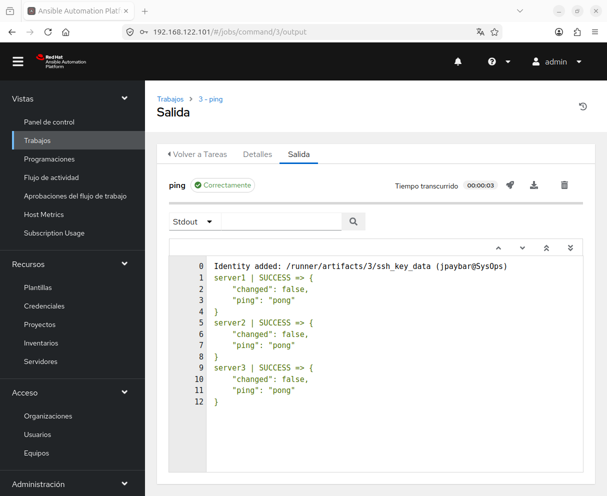

---

### 6.7 Job Template

`Resources → Templates → Add → Add job template`

> 💡 **What is a Workflow Job Template?** Chains Job Templates in sequence with conditions. It's the CI/CD pipeline equivalent. Not used in this step.

| Field                 | Value                              |
| --------------------- | ---------------------------------- |
| Name                  | `jpaybar_wordpress_deploy`         |
| Job Type              | `Run`                              |
| Inventory             | `jpaybar_inventory`                |
| Project               | `jpaybar_wordpress`                |
| Execution Environment | `Default execution environment`    |
| Playbook              | `Ansible-roles/Playbooks/site.yml` |
| Credentials           | `jpaybar_ssh_key`                  |

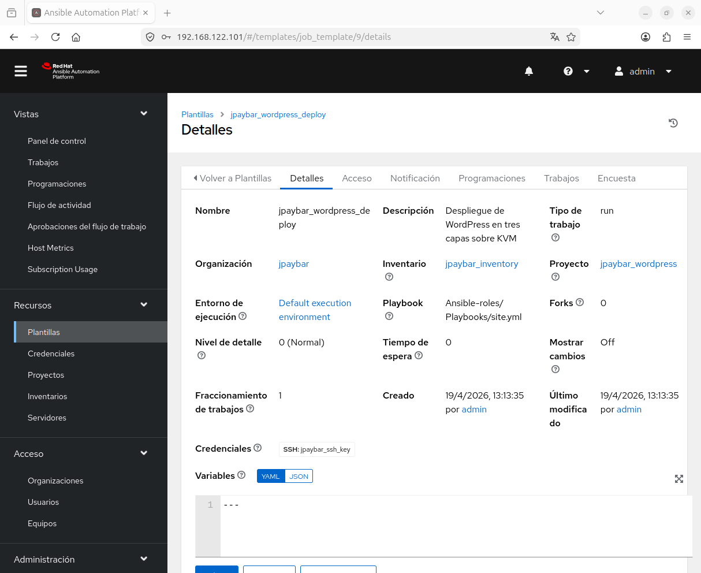

---

### 6.8 Launch the Job and Verify Deployment

`Resources → Templates → jpaybar_wordpress_deploy → 🚀`

AAP delegates execution to the **execution node** (`192.168.122.102`), not the controller. Expected result: **✅ Successful** with WordPress accessible at `http://192.168.122.35/wordpress`.

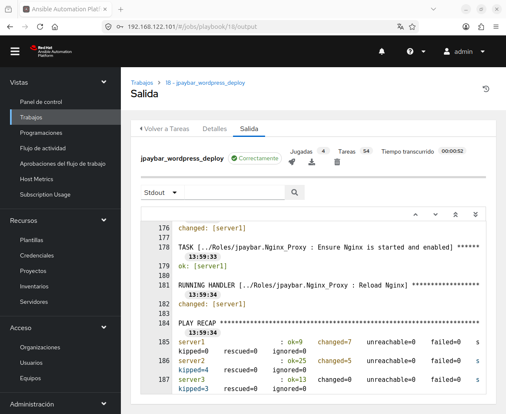

---

## 7. Role-Based Access Control (RBAC)

Users in AAP are created as type `Normal` and privileges are assigned via **roles on specific resources**, not at the user type level.

### User Types

| Type                   | Description                                  |
| ---------------------- | -------------------------------------------- |
| `Normal`               | No system privileges. Permissions via roles. |
| `System Auditor`       | Read-only access to all AAP resources.       |
| `System Administrator` | Full control equivalent to the `admin` user. |

### Users Created

`Access → Users → Add`

| User        | Type   | Organization |
| ----------- | ------ | ------------ |
| `operator`  | Normal | `jpaybar`    |
| `developer` | Normal | `jpaybar`    |

### Roles Assigned

`Access → Users → [user] → Roles → Add roles`

| User        | Resource                   | Resource Type | Role      |
| ----------- | -------------------------- | ------------- | --------- |
| `operator`  | `jpaybar_wordpress_deploy` | Job Template  | `Execute` |
| `developer` | `jpaybar_wordpress_deploy` | Job Template  | `Admin`   |
| `developer` | `jpaybar_wordpress`        | Project       | `Use`     |

### Verification

* `operator` — can only see and launch the template. Cannot modify anything or access credentials, projects, or inventories.
* `developer` — can view and modify the template and use the project. Does not administer the platform.

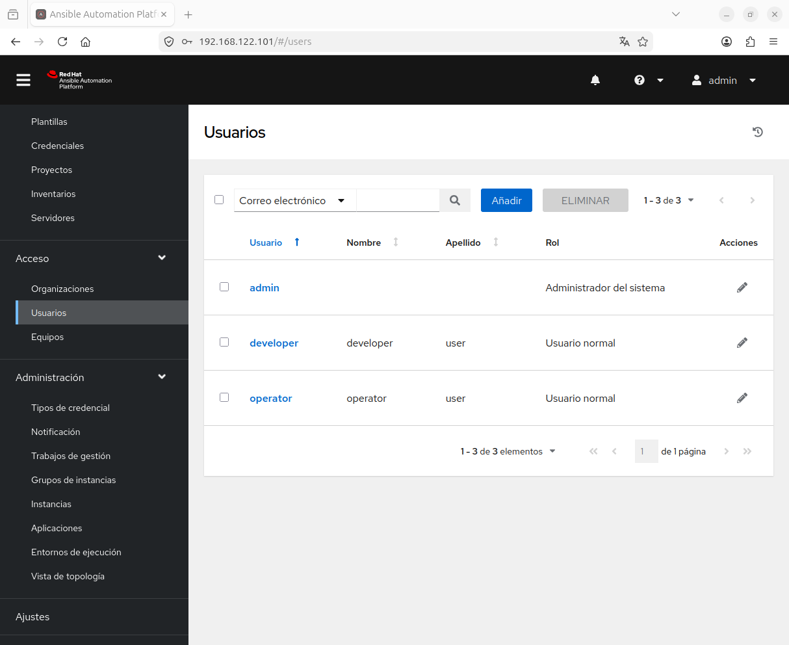

---

## 8. Execution Environments (EE)

Execution Environments are OCI containers that define the execution environment: Ansible version, installed collections, and Python dependencies. They allow simultaneously managing modern and legacy playbooks without version conflicts.

### EE Types in AAP 2.4

| EE                                    | Use                                               |
| ------------------------------------- | ------------------------------------------------- |
| `Default execution environment`       | Standard EE. Latest supported Ansible core.       |
| `Control Plane Execution Environment` | Controller internal use. **Do not use for jobs.** |
| `Minimal execution environment`       | No collections. For very specific use cases.      |

### 8.1 Modern EE vs Legacy EE

| EE            | Ansible core | Use case                      |
| ------------- | ------------ | ----------------------------- |
| Default EE    | 2.15+        | Current roles and playbooks   |
| `ee-29-rhel8` | 2.9          | Legacy playbooks without FQCN |

> 💡 **What are FQCNs?** Since Ansible 2.10, using the full module name is recommended (`ansible.builtin.apt` instead of `apt`). Legacy playbooks use the short form, which was definitively removed in ansible-core 2.16.

### 8.2 Configuring the Legacy EE: `ee-29-rhel8`

Red Hat provides an official image with Ansible 2.9 in its registry. No need to build or manually download images — AAP manages this automatically through registry credentials.

#### Step 1 — Create Registry Credential

`Resources → Credentials → Add`

| Field              | Value                            |
| ------------------ | -------------------------------- |
| Name               | `redhat_registry`                |
| Credential Type    | `Container Registry`             |
| Authentication URL | `registry.redhat.io`             |
| Username           | Red Hat user (portal.redhat.com) |
| Password           | Red Hat password                 |

#### Step 2 — Register the EE in AAP

`Administration → Execution Environments → Add`

| Field               | Value                                                                  |
| ------------------- | ---------------------------------------------------------------------- |
| Name                | `ee-29-rhel8`                                                          |
| Image               | `registry.redhat.io/ansible-automation-platform-21/ee-29-rhel8:latest` |
| Pull                | `Only pull the image if not present before running`                    |
| Description         | `Ansible 2.9 - Legacy EE for compatibility with pre-AAP 2.x playbooks` |
| Organization        | `jpaybar`                                                              |
| Registry Credential | `redhat_registry`                                                      |

**Pull field options:**

| Value                                               | Behavior                                      |
| --------------------------------------------------- | --------------------------------------------- |
| `Always pull container before running`              | Downloads image from registry before each job |
| `Only pull the image if not present before running` | Downloads once, reuses local copy             |
| `Never pull container before running`               | Assumes image is already local, no download   |

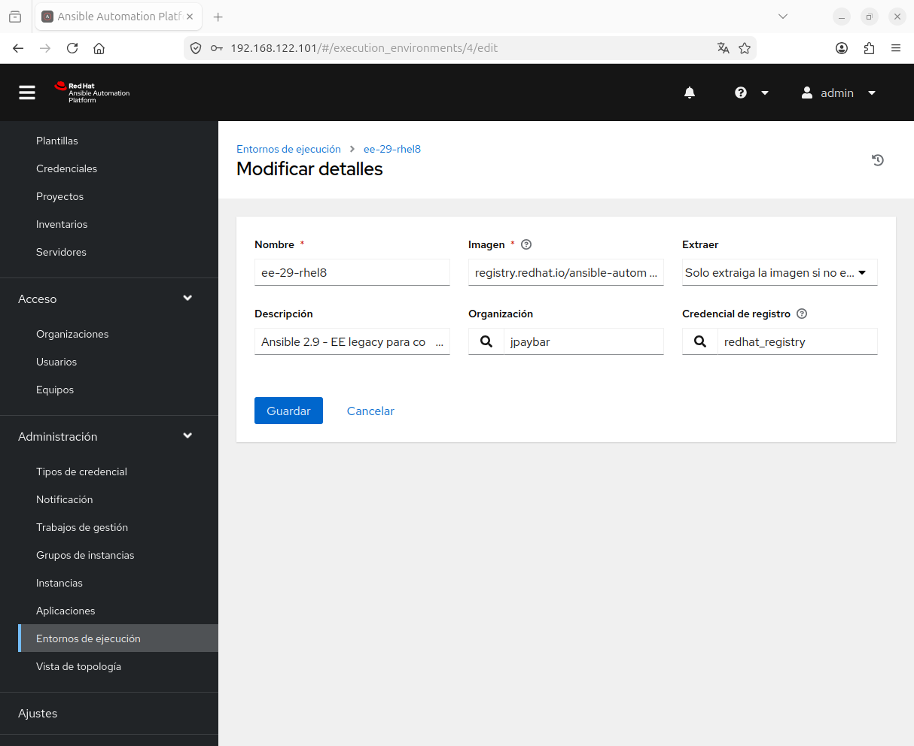

#### Step 3 — Legacy VM Ubuntu 18.04

```bash
./setup_legacy_vm.sh
```

The script verifies the base image is available and provides download instructions if not. Generates `hosts_legacy.yml` with the DHCP-assigned IP.

| Resource | Value                     |
| -------- | ------------------------- |
| vCPUs    | 2                         |
| RAM      | 2 GB                      |
| Disk     | 10 GB                     |
| OS       | Ubuntu 18.04 LTS (Bionic) |

#### Step 4 — Legacy Inventory

`Resources → Inventories → Add → Add inventory`

| Field        | Value                      |
| ------------ | -------------------------- |
| Name         | `jpaybar_inventory_legacy` |
| Organization | `jpaybar`                  |

Host added (`Hosts → Add`): `server-legacy` with `ansible_host: <assigned IP>`

#### Step 5 — Legacy Job Template

| Field                 | Value                                                                                    |
| --------------------- | ---------------------------------------------------------------------------------------- |
| Name                  | `jpaybar_wordpress_legacy`                                                               |
| Inventory             | `jpaybar_inventory_legacy`                                                               |
| Project               | `jpaybar_wordpress`                                                                      |
| Execution Environment | `ee-29-rhel8`                                                                            |
| Playbook              | `Ansible-playbooks/WORDPRESS_LAMP_ubuntu1804_2004/playbook.yml`                          |
| Credentials           | `jpaybar_ssh_key`                                                                        |
| Variables             | `ansible_ssh_common_args: "-o StrictHostKeyChecking=no -o UserKnownHostsFile=/dev/null"` |

### 8.3 Incompatibility Demonstration

The legacy playbook includes `tasks/pre_checks.yml` with system validations (RAM, disk, OS) invoked via `include` — syntax removed in ansible-core 2.16.

**With `Default execution environment` (ansible-core 2.15+):**

```
ERROR! [DEPRECATED]: ansible.builtin.include has been removed.
Use include_tasks or import_tasks instead.
```

**With `ee-29-rhel8` (Ansible 2.9):**

```
PLAY RECAP
server-legacy : ok=21 changed=9 unreachable=0 failed=0 skipped=4 rescued=0 ignored=1
```

This demonstrates the real value of managing multiple EEs in AAP: running the same playbook in the correct EE without modifying the legacy code.

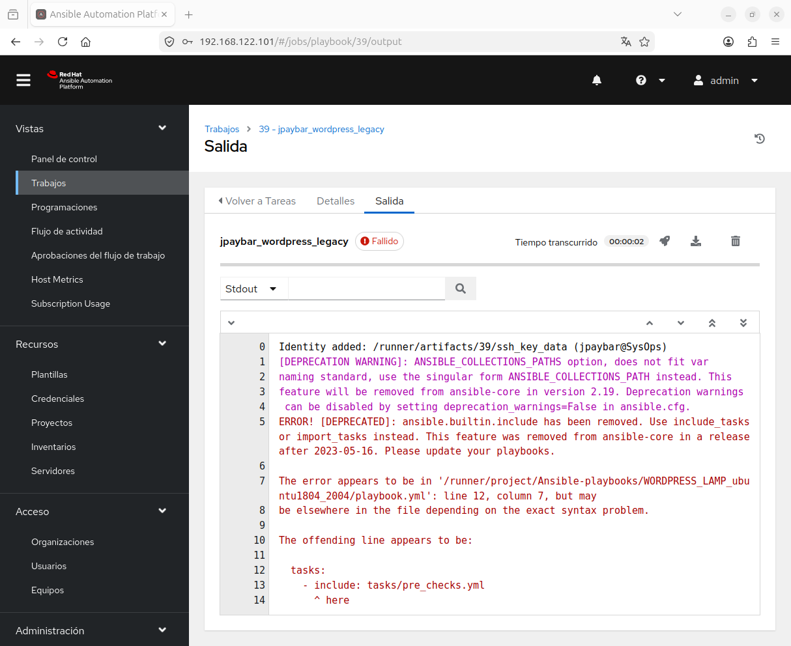
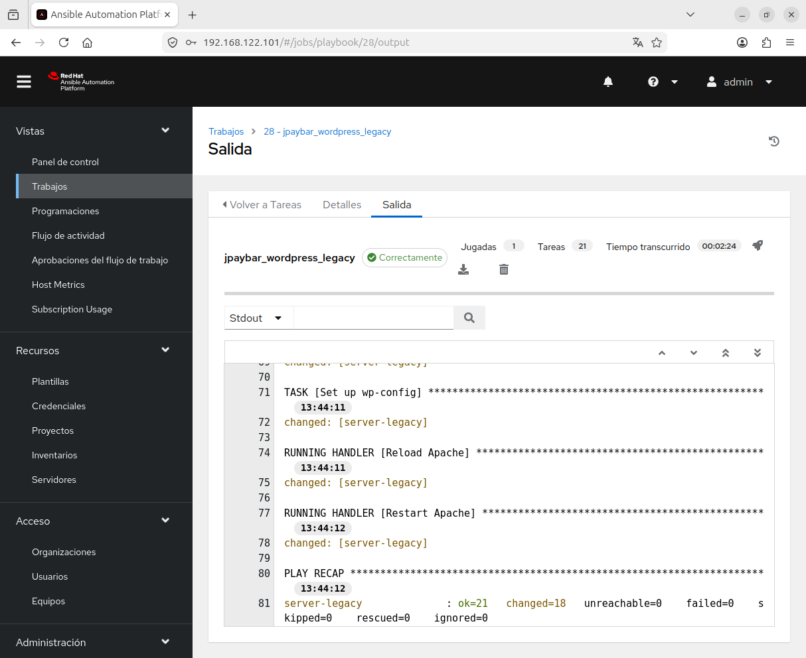

---

## 9. Known Issues and Solutions

### ⚠️ `mysql_user` not found

**Symptom:** Job fails with `ERROR! couldn't resolve module/action 'mysql_user'`.

**Cause:** The `community.mysql` collection is not included in the default EE.

**Solution:** Add `collections/requirements.yml` at the repo root with `community.mysql` and `community.general`.

---

### ⚠️ SSH fingerprint timeout

**Symptom:** Jobs fail with `Connection timed out during banner exchange`.

**Cause:** The execution node has not previously connected to the target VMs and waits for interactive fingerprint confirmation.

**Solution:** Add `StrictHostKeyChecking=no` and `UserKnownHostsFile=/dev/null` to inventory group variables.

---

### ⚠️ Repo `group_vars` not loaded in AAP

**Symptom:** Variables defined in the repo's `group_vars/` are not available in jobs.

**Cause:** With manual inventory in AAP, Ansible does not look for `group_vars` in the repo — it only does so when using an inventory file.

**Solution:** Define variables manually in each AAP inventory group, or configure an Inventory Source pointing to the repo's `hosts.yml`.

---

## 10. Official Documentation

📚 For detailed technical information on AAP 2.4:

🔗 https://access.redhat.com/documentation/en-us/red_hat_ansible_automation_platform/2.4

| Resource                  | URL                                                                                                                                                               |
| ------------------------- | ----------------------------------------------------------------------------------------------------------------------------------------------------------------- |
| AAP 2.4 Documentation     | https://docs.redhat.com/en/documentation/red_hat_ansible_automation_platform/2.4                                                                                  |
| Execution Environments    | https://docs.redhat.com/en/documentation/red_hat_ansible_automation_platform/2.4/html/automation_controller_user_guide/assembly-controller-execution-environments |
| Red Hat Container Catalog | https://catalog.redhat.com/software/containers/search?q=ansible+execution+environment                                                                             |
| Red Hat Portal            | https://access.redhat.com                                                                                                                                         |
| AAP Logs                  | `/var/log/tower/`                                                                                                                                                 |
| AAP Service Status        | `automation-controller-service status`                                                                                                                            |

---

## 👤 Author Information

**Juan Manuel Payán Barea** — Systems Administrator | SysOps | IT Infrastructure

st4rt.fr0m.scr4tch@gmail.com  
GitHub: https://github.com/jpaybar  
LinkedIn: https://es.linkedin.com/in/juanmanuelpayan
