# RHAAP: Enterprise-grade Ansible Automation

## Red Hat Ansible Automation Platform 2.4

###### By Juan Manuel Payán Barea / jpaybar

[st4rt.fr0m.scr4tch@gmail.com](mailto:st4rt.fr0m.scr4tch@gmail.com)

---

## Table of Contents

1. [Overview](#1-overview)
2. [Environment](#2-environment)
3. [Prerequisites](#3-prerequisites)
4. [Project Structure](#4-project-structure)
5. [`.env` File](#5-env-file)
6. [Script `deploy-rhaap-lab.sh`](#6-script-deploy-rhaap-labsh)
   - [Pre-flight Checks](#61-pre-flight-checks)
   - [VM Resources](#62-vm-resources)
   - [Host SSH Configuration](#63-host-ssh-configuration)
   - [Per-VM Cloud-init](#64-per-vm-cloud-init)
   - [VM Deployment](#65-vm-deployment)
7. [Script `prepare-rhaap-install.sh`](#7-script-prepare-rhaap-installsh)
   - [Cloud-init Wait](#71-cloud-init-wait)
   - [SSH Key Distribution Between VMs](#72-ssh-key-distribution-between-vms)
   - [Bundle Copy and Verification](#73-bundle-copy-and-verification)
   - [Inventory Processing](#74-inventory-processing)
   - [Bundle Extraction and Inventory Placement](#75-bundle-extraction-and-inventory-placement)
8. [Script `main.sh` — Single Entry Point](#8-script-mainsh--single-entry-point)
9. [`inventory` File](#9-inventory-file)
10. [Launching the Installation](#10-launching-the-installation)
11. [First Steps After Installation](#11-first-steps-after-installation)
    - [AAP Subscription](#step-1--aap-subscription)
    - [User and Automation Analytics](#step-2--user-and-automation-analytics)
    - [License Agreement (EULA)](#step-3--license-agreement-eula)
    - [Initial Checks](#post-wizard-initial-checks)
    - [Basic AAP Structure](#step-4--basic-aap-structure--initial-configuration-flow)
12. [Known Issues and Solutions](#12-known-issues-and-solutions)
13. [Official Documentation](#13-official-documentation)

---

## 1. Overview

📌 This project provides a fully automated deployment of **Red Hat Ansible Automation Platform 2.4** on three KVM/libvirt virtual machines running RHEL 9.7.

It includes VM provisioning via cloud-init, environment preparation, and AAP 2.4 deployment using a reproducible, Bash-script-based approach.

The goal is to simplify the installation process while providing a hands-on environment for learning, testing, and experimenting with Red Hat's enterprise automation platform.

> **Why AAP 2.4 and not 2.5?**  
> AAP 2.5 enforces a *Growth* topology that requires a dedicated *gateway* node, raising the minimum VM count to four and exceeding the practical RAM limits of the host used for this lab. AAP 2.4 allows a fully functional deployment with three nodes.

### Architecture

| VM         | Hostname                   | IP              | Role                                       |
| ---------- | -------------------------- | --------------- | ------------------------------------------ |
| controller | rhaap-controller.lab.local | 192.168.122.101 | Automation Controller (UI, API, scheduler) |
| execution  | rhaap-execution.lab.local  | 192.168.122.102 | Execution Node (job execution)             |
| database   | rhaap-database.lab.local   | 192.168.122.103 | PostgreSQL (managed by the installer)      |

* **Network:** `default` (libvirt NAT, `192.168.122.0/24`)
* **Static IPs:** reserved in dnsmasq DHCP via fixed MACs
* **Guest OS:** RHEL 9.7 (KVM cloud image `.qcow2`)
* **Initial provisioning:** cloud-init (user-data)

---

## 2. Environment

🧪 The deployment has been tested with the following configuration:

### 🖥️ Host System

* OS: Ubuntu 24.04
* CPU: AMD Ryzen 5 3600 (6 cores)
* RAM: 32 GB
* Storage: NVMe SSD

### ⚙️ Virtualization

* Hypervisor: KVM (libvirt)
* Network: libvirt `default` network (NAT, `192.168.122.0/24`)
* Static IPs via DHCP reservations in dnsmasq

### 💻 Virtual Machines

| VM         | vCPU | RAM  | Disk  |
| ---------- | ---- | ---- | ----- |
| controller | 2    | 8 GB | 40 GB |
| execution  | 2    | 4 GB | 20 GB |
| database   | 2    | 4 GB | 20 GB |

* OS: RHEL 9.7 (KVM cloud image `.qcow2`)
* Cloud-init enabled on all VMs

---

## 3. Prerequisites

### 🖥️ On the KVM Host

* KVM/libvirt installed and running (`libvirtd` active)
* `virt-install`, `qemu-img`, and `virsh` available
* `envsubst` (`gettext` package)
* libvirt `default` network active
* Internet access for RHSM registration and downloads from `registry.redhat.io`

### 📦 Base Image

The required base image is the **RHEL 9.7 KVM Guest Image**:

```
/var/lib/libvirt/user-images/rhel-9.7-x86_64-kvm.qcow2
```

Download it from [access.redhat.com/downloads](https://access.redhat.com/downloads) and place it in the directory with the appropriate permissions:

```bash
sudo chown root:libvirt /var/lib/libvirt/user-images/rhel-9.7-x86_64-kvm.qcow2
sudo chmod 0664 /var/lib/libvirt/user-images/rhel-9.7-x86_64-kvm.qcow2
```

### 📦 AAP 2.4 Bundle

Download the bundle from the Red Hat portal and place it in the same directory as the scripts:

```
ansible-automation-platform-setup-bundle-2.4-16-x86_64.tar.gz
```

---

## 4. Project Structure

```
RHAAP_2.4_deployment/
├── .gitignore
├── .env                          # Credentials
├── main.sh                       # Entry point: orchestrates the full deployment
├── deploy-rhaap-lab.sh           # Phase 1: creates and configures the three VMs
├── prepare-rhaap-install.sh      # Phase 2: prepares the controller for ./setup.sh
├── inventory                     # AAP 2.4 inventory template (with placeholders)
├── pics/                         # Screenshots
├── README.md                     # English documentation
├── README_es.md                  # Spanish documentation
└── ansible-automation-platform-setup-bundle-2.4-16-x86_64.tar.gz   # AAP 2.4 bundle---
```

## 5. `.env` File

All credentials are centralized in `.env`. Add it to `.gitignore`.

```bash
# .env
export RH_USERNAME="user@redhat.com"
export RH_PASSWORD="your_rhn_password"
export ADMIN_PASSWORD="aap_admin_password"
export PG_PASSWORD="postgresql_password"
```

> The use of `export` is mandatory. Both `deploy-rhaap-lab.sh` and `prepare-rhaap-install.sh` run `source .env`, and the variables must be exported so that subshells (`envsubst`, cloud-init) can access them.

---

## 6. Script `deploy-rhaap-lab.sh`

Creates and configures the three lab VMs. Can be run directly or via `main.sh`.

### 6.1 Pre-flight Checks

Before creating anything, the script verifies:

* That the storage directory `/var/lib/libvirt/user-images` exists.
* That the base image `rhel-9.7-x86_64-kvm.qcow2` is present in that directory.

If any condition is not met, the script aborts with a descriptive error message and resolution instructions.

### 6.2 VM Resources

Resources are defined using associative arrays, making it easy to add or modify nodes without touching the script logic:

| VM         | RAM (MB) | vCPUs | Disk  |
| ---------- | -------- | ----- | ----- |
| controller | 8192     | 2     | 40 GB |
| execution  | 4096     | 2     | 20 GB |
| database   | 4096     | 2     | 20 GB |

Disks are created as **copy-on-write (COW)** images on top of the base image using `qemu-img create -f qcow2 -b`, so the base image is never modified.

IPs and MACs are static and registered in the libvirt dnsmasq DHCP via `virsh net-update` before each VM boots, ensuring the assigned IP always matches the one defined in the inventory.

### 6.3 Host SSH Configuration

The script manages `~/.ssh/config` on the host:

* If it does not exist, it creates it with `600` permissions.
* Adds a block for the three node IPs with `StrictHostKeyChecking no` and `UserKnownHostsFile /dev/null`, avoiding host verification prompts on re-deployments.
* The block is only added once; on re-deployments it detects that it already exists and does not duplicate it.

Additionally, before creating each VM, it clears its entry in `~/.ssh/known_hosts` to avoid fingerprint conflicts.

### 6.4 Per-VM Cloud-init, OS-level Requirements Defined by Red Hat

For each VM, a `user-data` file is generated at `/tmp/rhaap-user-data-<vm>` containing:

* **Hostname and FQDN** (`rhaap-<vm>` / `rhaap-<vm>.lab.local`)
* **`/etc/hosts`** with the three lab nodes, managed by `write_files` (`manage_etc_hosts: false`)
* **Host's public SSH key** injected into `root` for direct access
* **`runcmd`** executed on first boot:
  * RHSM registration (`subscription-manager register --auto-attach`) with credentials from `.env`
  * `dnf update -y`
  * SELinux in `enforcing` mode
  * `firewalld` and `chronyd` enabled
  * `sshd` restart

### 6.5 VM Deployment

For each VM the script executes in order:

1. Removes the VM if it already existed (including its storage), allowing clean re-deployments.
2. Creates the COW disk.
3. Registers the DHCP reservation in dnsmasq.
4. Generates the cloud-init configuration.
5. Launches `virt-install --import --noautoconsole`.

When finished, it prints a summary with the hostname, FQDN, IP, RAM, and vCPUs of each VM.

---

## 7. Script `prepare-rhaap-install.sh`

Prepares the controller so the installer can run with `./setup.sh`. It connects to the controller via SSH and performs all necessary operations remotely.

### 7.1 Cloud-init Wait

Before doing anything, the script waits for the controller to complete its initialization:

```bash
ssh root@192.168.122.101 "cloud-init status --wait"
```

This blocks until cloud-init returns `done`, ensuring the system is registered in RHSM and fully configured before proceeding.

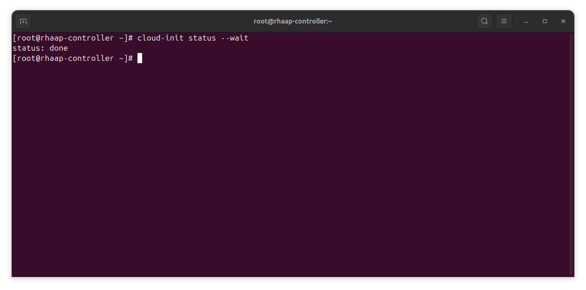

### 7.2 SSH Key Distribution Between VMs

The AAP installer requires the controller to be able to SSH into all nodes (including itself) without a password. The script:

1. Generates an `rsa 4096` SSH key at `/root/.ssh/id_rsa` on the controller if it does not exist.
2. Retrieves the controller's public key.
3. Distributes it to all three nodes (appends to `root`'s `authorized_keys`).
4. Populates the controller's `known_hosts` with the fingerprints of all three nodes via `ssh-keyscan`.

### 7.3 Bundle Copy and Verification

The bundle is copied to the controller via `scp` and verified by comparing the file size in bytes (`stat -c%s`) between the local file and the remote copy. If the sizes do not match, the script aborts indicating a possible transfer corruption.

### 7.4 Inventory Processing

The `inventory` file contains placeholders (`${ADMIN_PASSWORD}`, `${PG_PASSWORD}`, `${RH_USERNAME}`, `${RH_PASSWORD}`). The script replaces them using `envsubst` before copying the inventory to the controller:

```bash
envsubst < inventory > /tmp/inventory-processed
scp /tmp/inventory-processed root@192.168.122.101:/root/inventory
```

The variables are available because `prepare-rhaap-install.sh` runs `source .env` at startup and the `.env` file declares them with `export`.

### 7.5 Bundle Extraction and Inventory Placement

* The bundle is extracted to `/root` on the controller using `tar xzf`.
* The extracted directory name is detected automatically (`ls -td ansible-automation-platform-*/`), without assuming a specific version.
* The processed inventory is copied into that directory, overwriting the sample `inventory` included with the bundle.
* The `.tar.gz` is removed from the controller to free up space.

---

## 8. Script `main.sh` — Single Entry Point

`main.sh` orchestrates the full deployment in two phases:

```
PHASE 1 → deploy-rhaap-lab.sh       (creates the VMs)
PHASE 2 → prepare-rhaap-install.sh  (prepares the controller)
```

Between the two phases it waits until all three VMs are reachable via SSH before proceeding:

```bash
until ssh -o ConnectTimeout=5 -o BatchMode=yes "root@<IP>" true; do
    sleep 10
done
```

**Usage:**

```bash
./main.sh
```

When launching `./main.sh`, the script runs the pre-flight checks, reuses the existing SSH key, and configures SSH access to the lab:

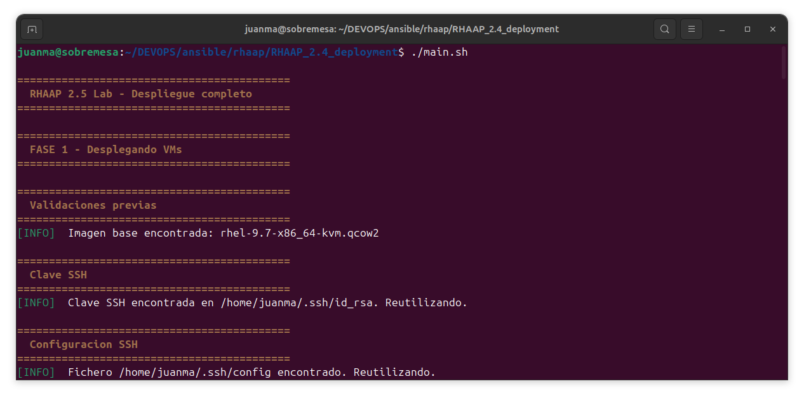

When Phase 2 completes, it displays a "Lab ready" summary with the instructions to launch the installer and confirms that all three VMs are in `running` state:

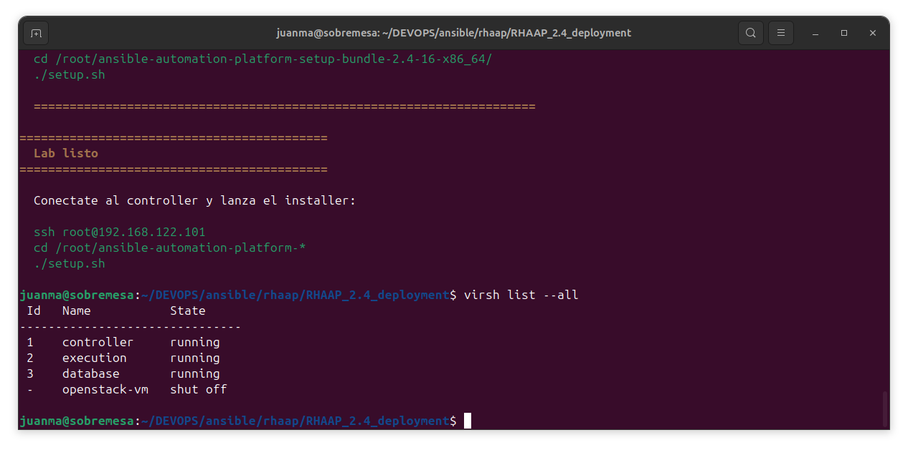

---

## 9. `inventory` File

The inventory defines the AAP 2.4 topology for the installer:

```ini
[automationcontroller]
controller ansible_host=192.168.122.101

[automationcontroller:vars]
peers=execution_nodes          # The controller initiates peering toward the execution nodes

[execution_nodes]
execution ansible_host=192.168.122.102

[database]
database ansible_host=192.168.122.103

# Optional
#[automationeda]
#[automationhub]

[all:vars]
ansible_user=root
admin_password=${ADMIN_PASSWORD}
pg_host=192.168.122.103
pg_port=5432
pg_database='awx'
pg_username='awx'
pg_password=${PG_PASSWORD}
pg_sslmode='prefer'
registry_url='registry.redhat.io'
registry_username=${RH_USERNAME}
registry_password=${RH_PASSWORD}
```

> The `${VARIABLE}` values are placeholders that `envsubst` replaces with the values from `.env` before copying the inventory to the controller.

---

## 10. Launching the Installation

Once `main.sh` (or `prepare-rhaap-install.sh`) finishes successfully, the installation is launched manually from the controller:

```bash
ssh root@192.168.122.101
cd /root/ansible-automation-platform-*/
./setup.sh
```

The installer (`setup.sh`) is an Ansible playbook that uses the `inventory` file in the current directory. The total time may vary depending on download speed.

When finished, the `PLAY RECAP` will show `failed=0` on all nodes and the message **"The setup process completed successfully."**:

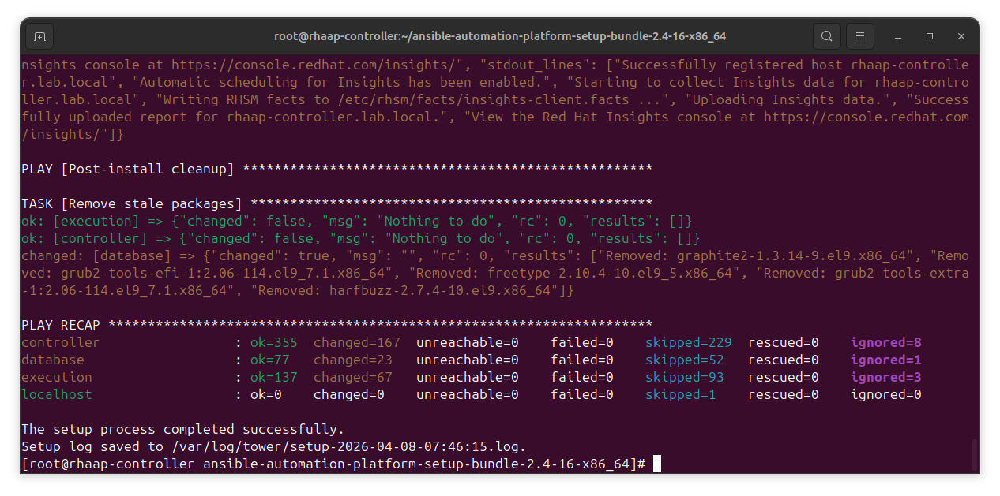

The web UI will be available at:

| Resource                 | URL                                 |
| ------------------------ | ----------------------------------- |
| Automation Controller UI | `https://192.168.122.101`           |
| Username                 | `admin`                             |
| Password                 | Value of `ADMIN_PASSWORD` in `.env` |

> The SSL certificate is self-signed.

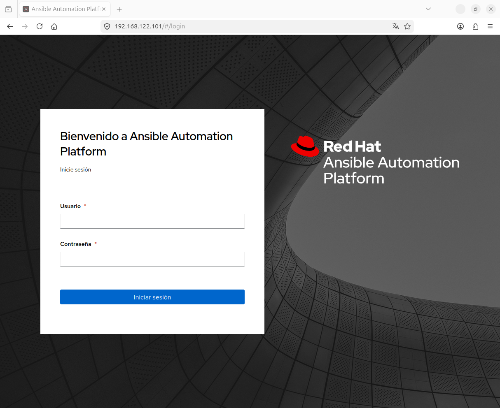

---

## 11. First Steps After Installation

> **Environment:** 3 RHEL VMs on KVM/libvirt — controller (`192.168.122.101`), execution node, database  
> **Initial access:** `https://192.168.122.101` — the self-signed certificate warning is expected, proceed anyway.

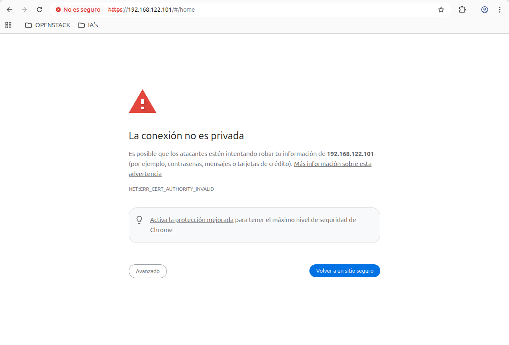

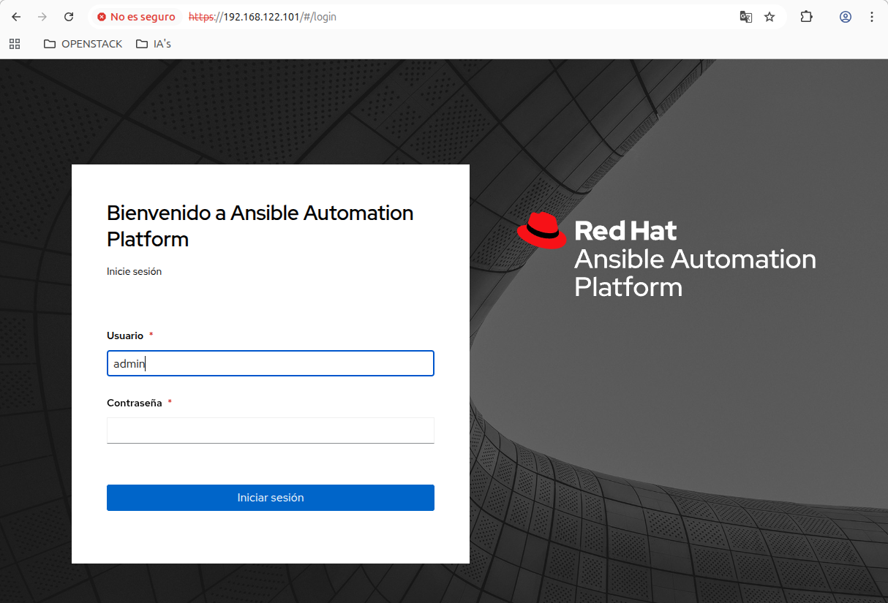

---

### Step 1 — AAP Subscription

This is the screen you see on first launch. There are 4 methods to activate the license:

| Method                    | When to use                                                |
| ------------------------- | ---------------------------------------------------------- |
| **Subscription Manifest** | Air-gapped environments (upload `.zip` from the RH portal) |
| **Username and Password** | Fastest option if the controller has internet access       |
| **Service Account**       | CI/CD pipelines, OAuth access                              |
| **Red Hat Satellite**     | Environments using Satellite to manage subscriptions       |

#### Recommended option for this lab: Username and Password

1. Click the **"Username and Password"** tab
2. Enter your **Red Hat Developer** credentials (the same as for `access.redhat.com`)
3. Click **"Get Subscriptions"** — the controller connects to `subscription.rhsm.redhat.com`
4. Select the **"Red Hat Ansible Automation Platform"** subscription associated with your Developer Sub
5. Click **"Next"**

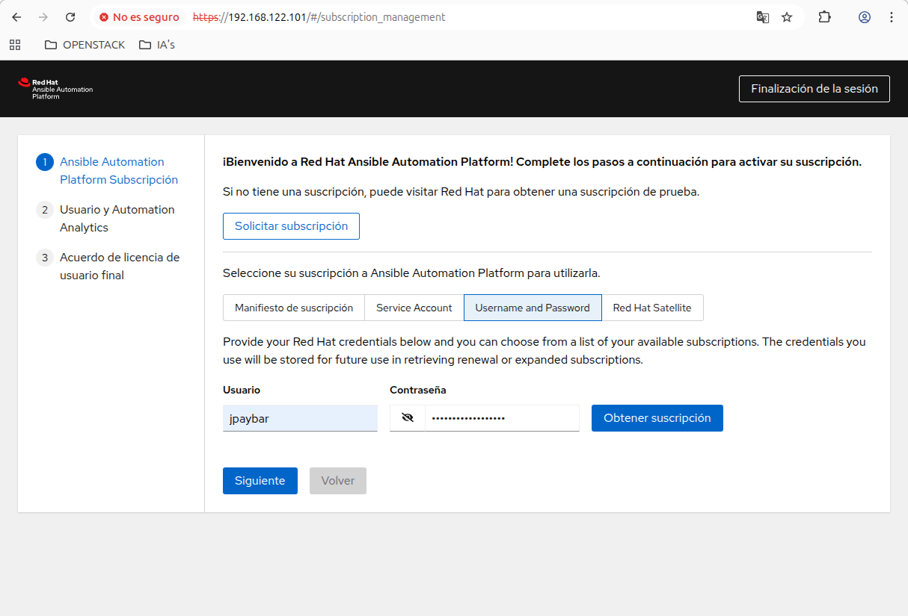

> **Note:** If the controller does NOT have internet access, use the **Subscription Manifest** method:
> 
> - Go to [access.redhat.com → Subscriptions → Subscription Allocations](https://access.redhat.com/management/subscription_allocations)
> - Create an allocation for AAP, export as `.zip`
> - Upload the `.zip` in the "Red Hat Subscription Manifest" field

---

### Step 2 — User and Automation Analytics

This screen manages telemetry only. There are no admin user fields here;
the `admin` user was already created during installation using the `admin_password`
defined in the inventory.

#### 2.1 Automation Analytics (telemetry)

Two checkboxes are enabled by default:

- **User Analytics** — usage data sent to Red Hat to improve the product
- **Automation Analytics** — playbook execution metrics sent to Red Hat

In a lab environment, uncheck both. They provide no value and require service account credentials
(Red Hat Client ID / Client Secret) that are not needed here.

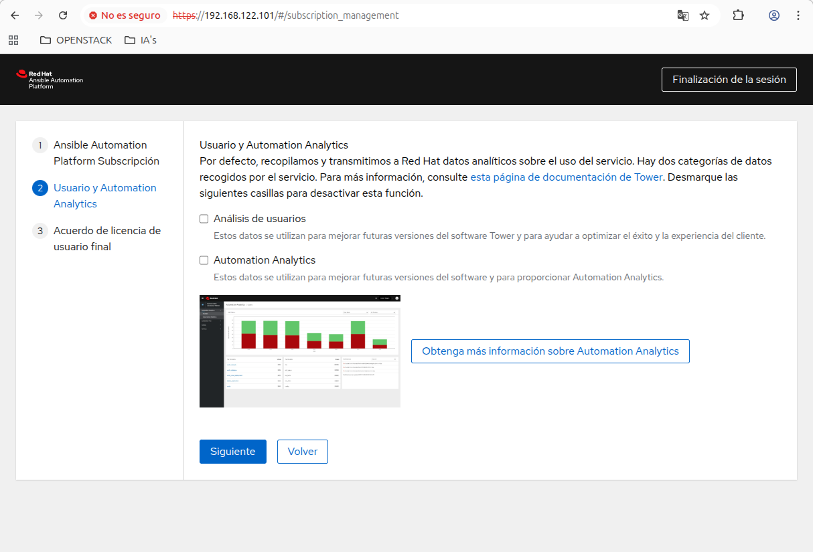

Click **"Next"**.

---

> **Note:** If you ever need to reset the `admin` user's password,
> run the following from the controller:
> 
> ```bash
> awx-manage changepassword admin
> ```

---

### Step 3 — License Agreement (EULA)

Read and accept the terms. Click **"Submit"**. After accepting, you will be redirected to the main AAP Dashboard.

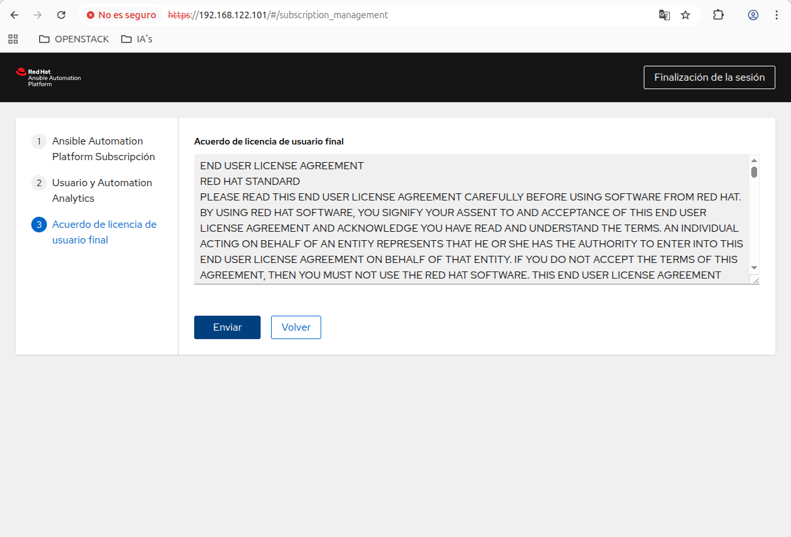

---

### Post-wizard: Initial Checks

Once inside the dashboard, verify the following before proceeding.

#### Verify that the Execution Node is registered

Navigate to `Administration → Instance Groups → default → "Instances" tab`.

You should see two nodes in **Ready** state:

| IP / hostname   | Type      |
| --------------- | --------- |
| 192.168.122.101 | hybrid    |
| 192.168.122.102 | execution |

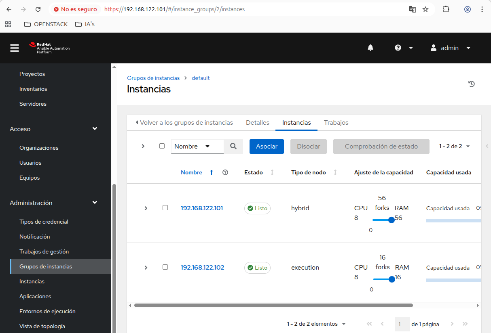

If the execution node appears as **Unavailable**, check the `receptor` service on the execution VM:

```bash
systemctl status receptor
```

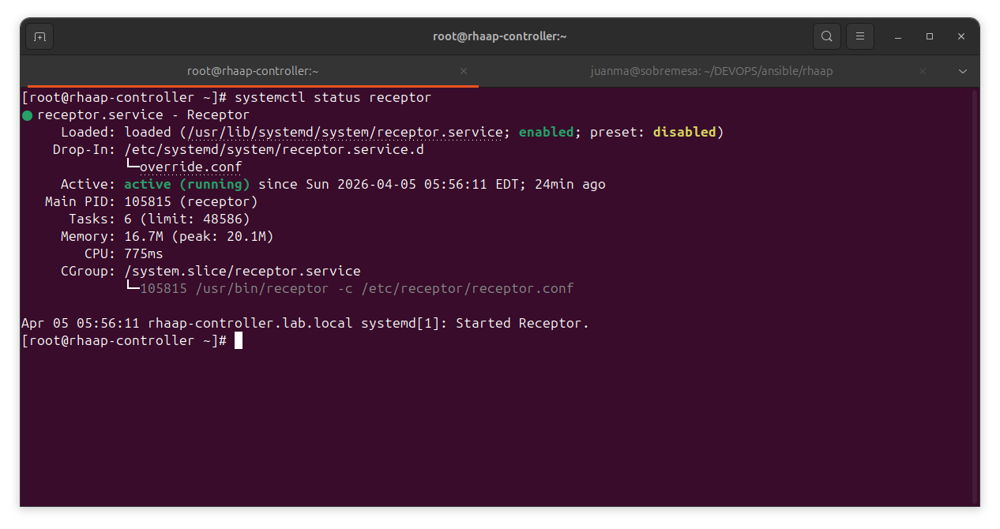

#### Verify the database connection

There is no database screen in the RHAAP 2.4 UI. Verify directly from the controller:

```bash
awx-manage check_migrations
```

It should return `No changes detected`.

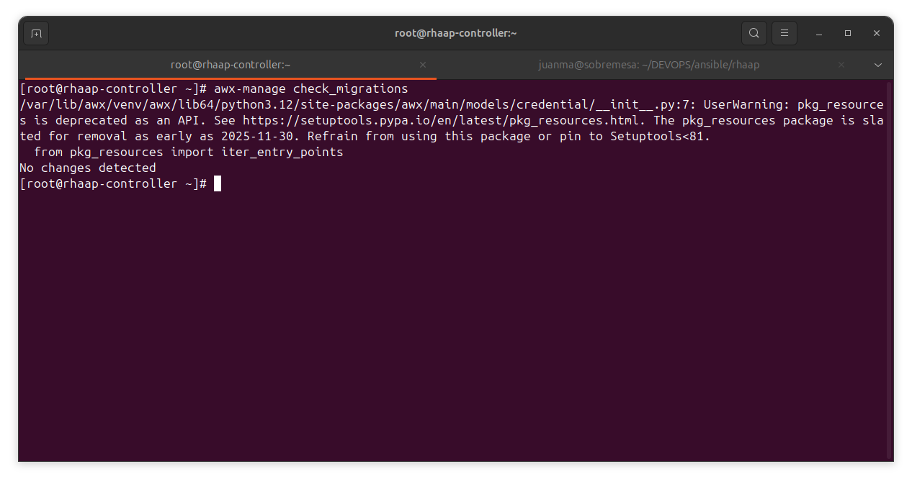

#### Verify the active license

There is no direct Subscription link in the side menu. Navigate to `Settings → Subscription → Subscription Configuration`. It should display the subscription type, expiration date, and number of managed hosts.

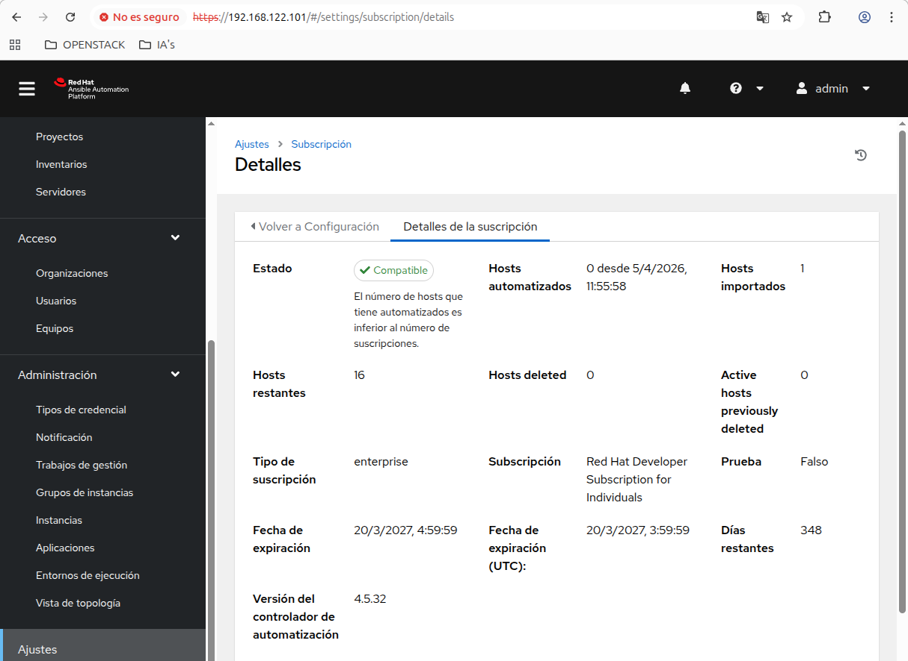

---

### Step 4 — Basic AAP Structure — Initial Configuration Flow

Once the environment is validated, the standard configuration flow is sequential:
each element depends on the previous one.

---

#### 1. Organizations

`Access → Organizations`

The organization is the logical container for everything in AAP: users, teams,
inventories, projects, and credentials always belong to an organization.
In a lab you can use the `Default` organization that comes pre-created.
In real environments, organizations are created per team, client, or environment
(production, development, etc.).

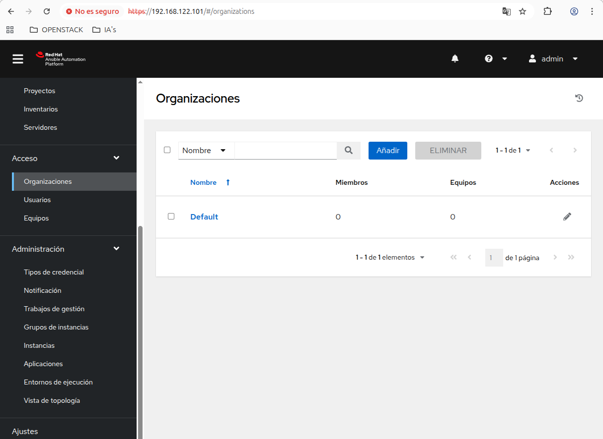

#### 2. Credentials

`Resources → Credentials → Add`

Credentials securely store the secrets AAP needs to connect to managed hosts.
The most common type in a lab is **Machine**, where you define the SSH user and
private key. AAP never exposes the credential value once saved. Other useful types:
**Source Control** (for private Git repos) and **Vault** (for Ansible Vault).

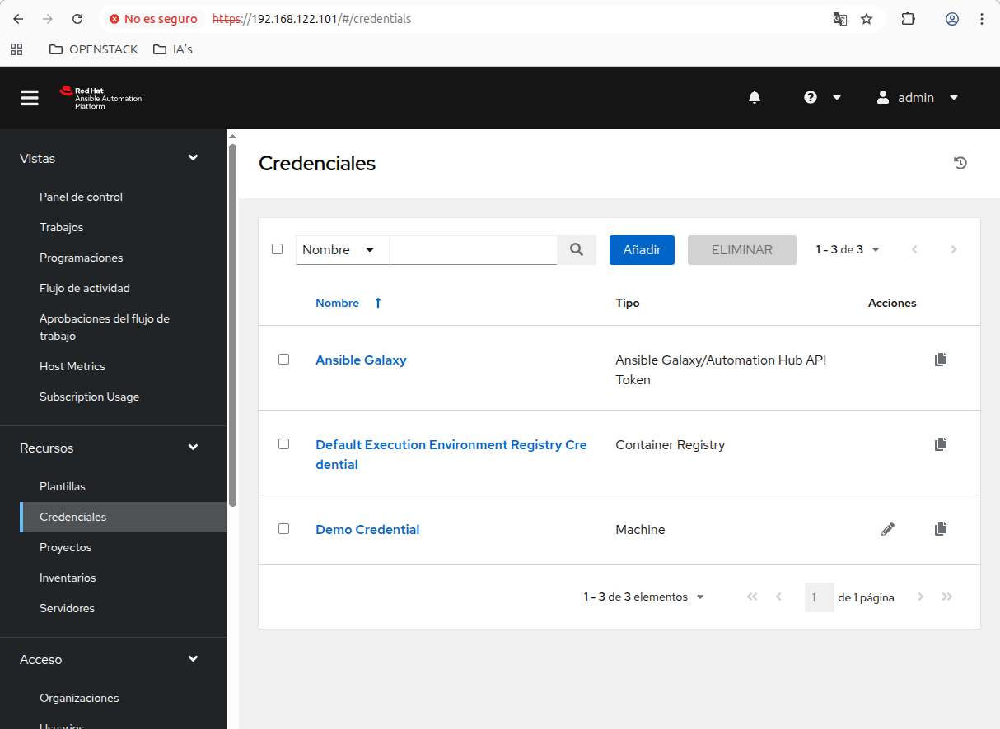

#### 3. Inventories

`Resources → Inventories → Add`

The inventory defines which hosts AAP will manage. There are two modes:

- **Static** — you enter hosts manually or import an INI/YAML file
- **Dynamic** — you use an *Inventory Source* that queries an external source
  (OpenStack, AWS, Azure, a script, etc.) and automatically syncs the hosts

In a lab with fixed VMs, a static inventory is sufficient. Dynamic inventory
is the standard approach in production.

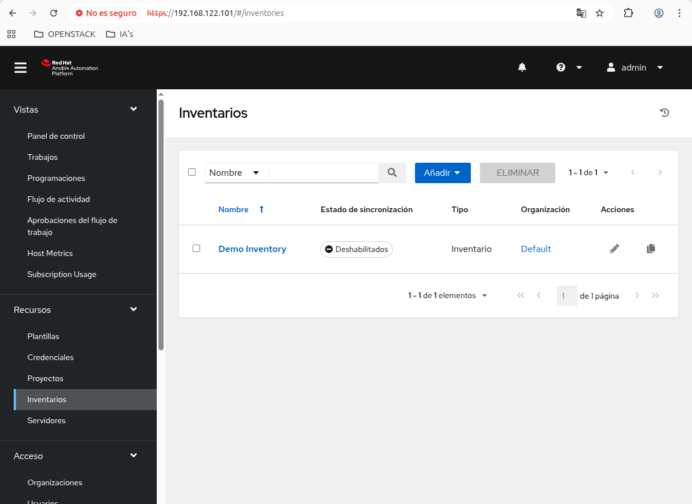

#### 4. Projects

`Resources → Projects → Add`

A project points to a Git repository (GitHub, GitLab, Gitea, etc.) where
your playbooks live. AAP clones the repository on the controller and
syncs it every time you launch a job or manually trigger a sync. You need
a **Source Control** credential created beforehand if the repository is
private. For public repositories, no credential is needed.

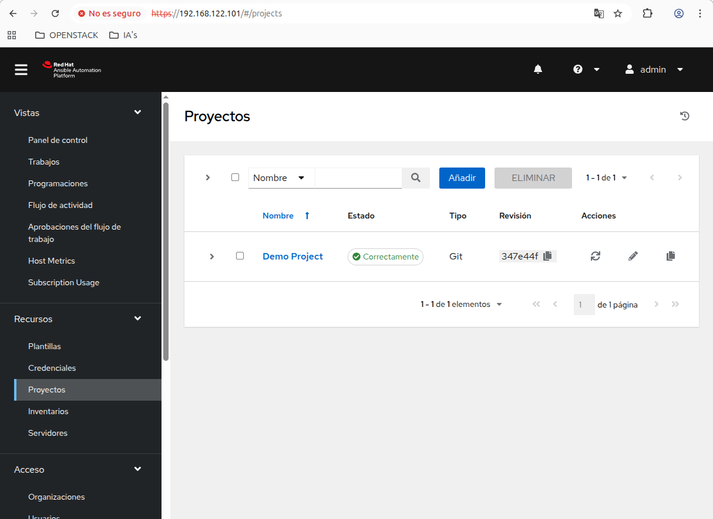

#### 5. Job Templates

`Resources → Templates → Add → Job Template`

The Job Template is the executable unit in AAP. It binds together in a single object:

- **Inventory** — which hosts to run against
- **Project** — which repository the playbook is sourced from
- **Playbook** — which `.yml` file within the project is launched
- **Credentials** — which SSH user and key to connect to the hosts with
- **Execution Environment** — which container environment the job runs in

Extra variables, host limits, check mode, and other settings are also configured here.

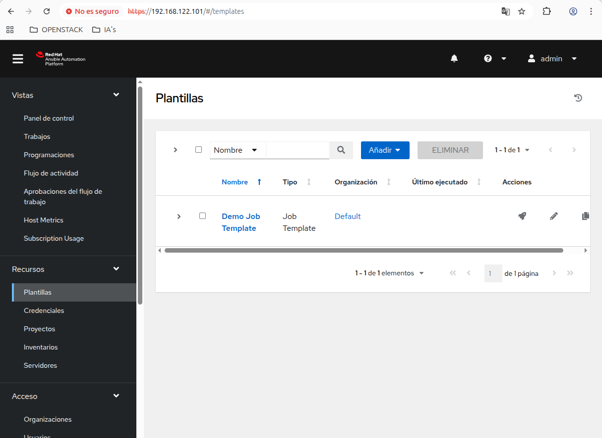

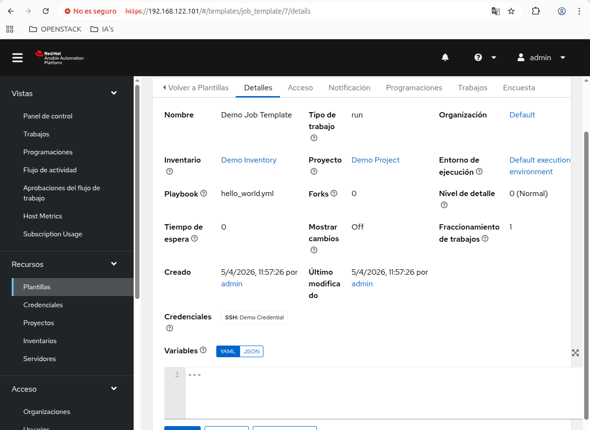

#### 6. Launching a Job

`Resources → Templates → [your template] → Launch`

When the Job Template is launched, AAP delegates execution to the **Execution Node**
(`192.168.122.102`). You can follow the execution in real time from
`Views → Jobs`. Verify that the job appears assigned to the execution node
and not to the controller — this confirms that the Receptor mesh is working correctly.

---

## 12. Known Issues and Solutions

### ⚠️ Receptor Mesh Error

**Symptom:** The installer fails with a receptor mesh topology error indicating that the controller cannot connect to the execution node.

**Cause:** Without the `peers=execution_nodes` directive in `[automationcontroller:vars]`, the controller does not know it must establish a mesh link toward the execution nodes.

**Solution:** Already included in the inventory:

```ini
[automationcontroller:vars]
peers=execution_nodes
```

---

## 13. Official Documentation

📚 For detailed technical information and advanced configuration, refer to the official Red Hat Ansible Automation Platform documentation:

🔗 https://access.redhat.com/documentation/en-us/red_hat_ansible_automation_platform/2.4

🧠 **Why it matters**

* Provides detailed explanations of each platform component and service
* Covers advanced configurations beyond the scope of this lab
* Useful for troubleshooting and real production scenarios

👉 This project focuses on a practical, simplified deployment on KVM, while the official documentation provides the complete technical reference.

| Resource                 | URL                                                                              |
| ------------------------ | -------------------------------------------------------------------------------- |
| Red Hat Portal           | https://access.redhat.com                                                        |
| Subscription Allocations | https://access.redhat.com/management/subscription_allocations                    |
| AAP 2.4 Documentation    | https://docs.redhat.com/en/documentation/red_hat_ansible_automation_platform/2.4 |
| Reset admin password     | `awx-manage changepassword admin` (on the controller)                            |
| Installation logs        | `/var/log/tower/`                                                                |
| AAP service status       | `automation-controller-service status`                                           |

---

## 👤 Author Information

**Juan Manuel Payán Barea** — Systems Administrator | SysOps | IT Infrastructure

st4rt.fr0m.scr4tch@gmail.com  
GitHub: https://github.com/jpaybar  
LinkedIn: https://es.linkedin.com/in/juanmanuelpayan
